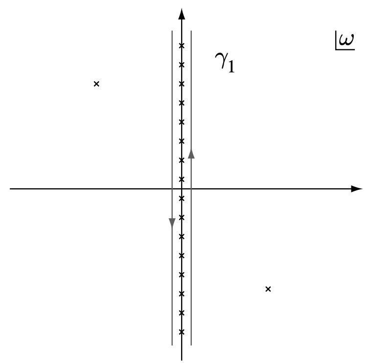
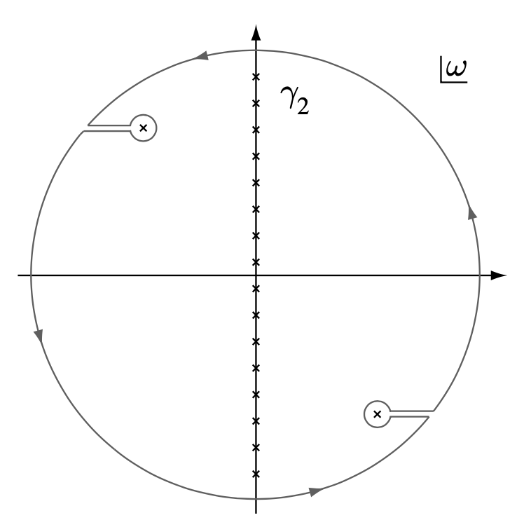
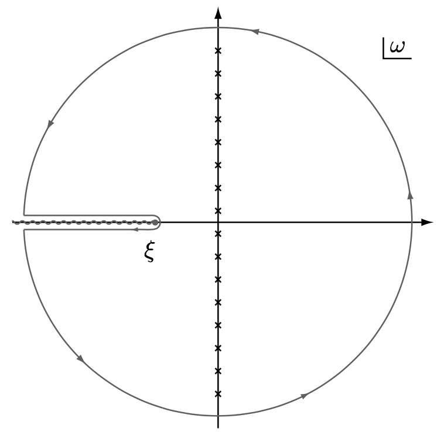
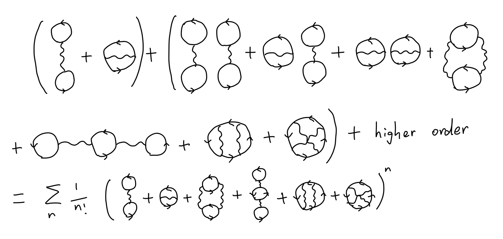
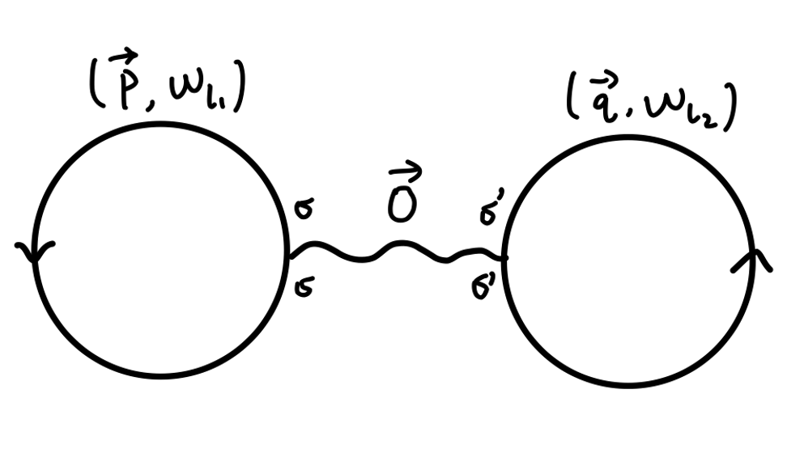
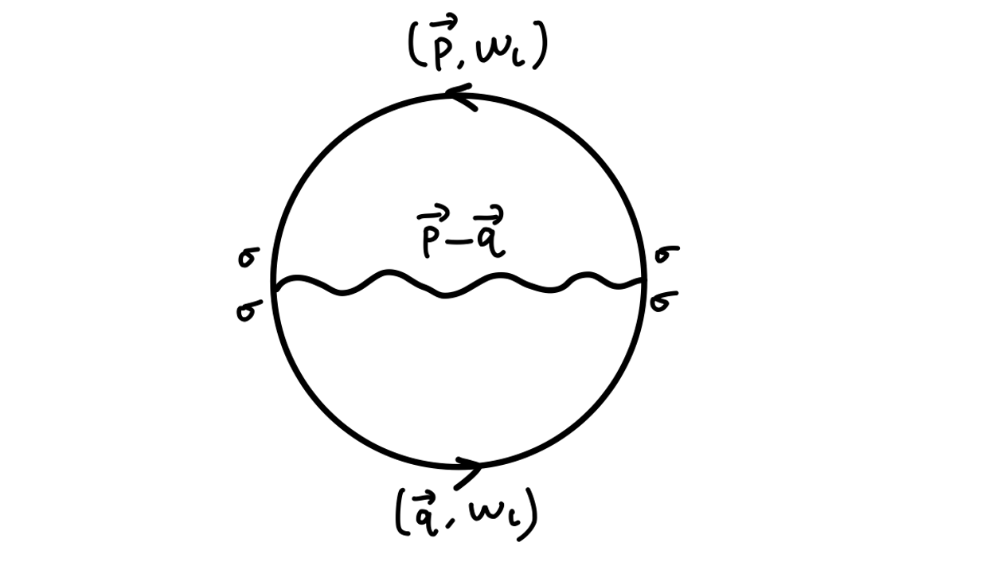
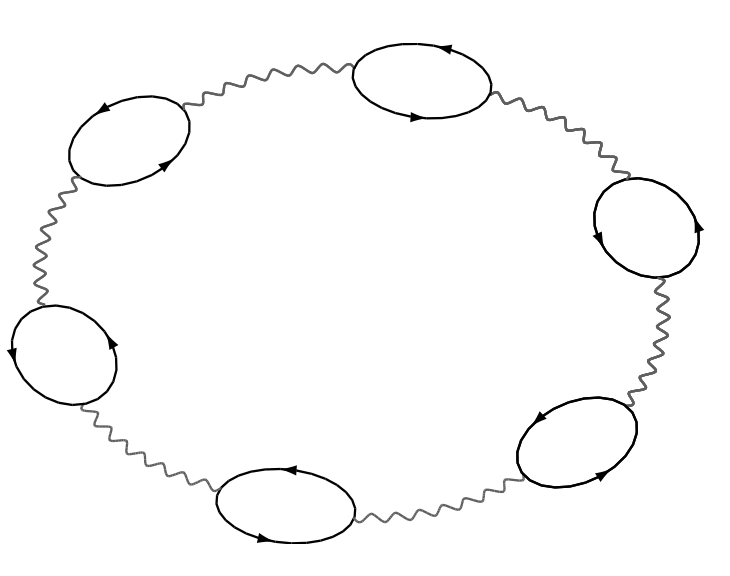
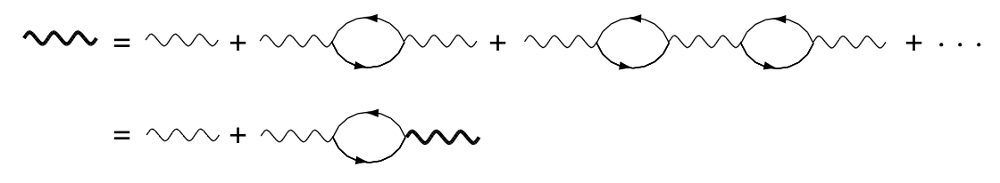
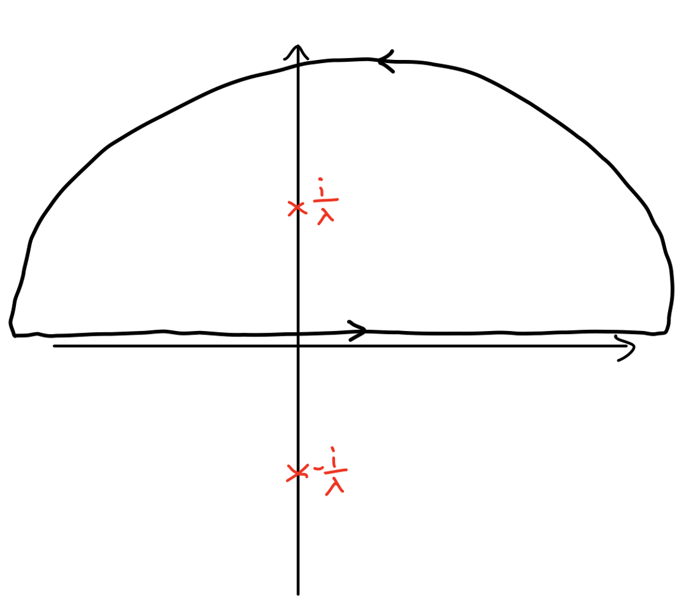

# 费米气体 RPA
## 傅立叶变换系数

对平移不变的场而言，物理量计算往往在动量空间中完成。为避免混淆傅立叶变换系数，我们在此明确函数和场的傅立叶变换，这里的规定和 Altland & Simons, *Condensed Matter Field Theory* 书中的规定是一样的。

场的傅立叶变换系数规定为：

$$
\begin{eqnarray}
	\psi_{p} & = & \frac{1}{\sqrt{\beta L^3}}\int d^4 x\ e^{-ip\cdot x}\psi(x),\\
	\psi(x) & = & \frac{1}{\sqrt{\beta L^3}} \sum_{p} e^{+ip\cdot x}\psi_{p}.
\end{eqnarray}
$$

其中记 4 坐标和 4 动量为：

$$
\begin{eqnarray}
	x & \equiv & (\vec r,\tau), \\
	p & \equiv & (\vec p,\omega_n), \\
	p\cdot x & \equiv & \vec p\cdot \vec r - \omega_n \tau.
\end{eqnarray}
$$

坐标积分和动量求和为：

$$
\begin{eqnarray}
	\int d^4 x &\equiv & \int_0^\beta d\tau \int d^3 r, \\
	\sum_p &\equiv & \sum_{\omega_n}\sum_{\vec p}
\end{eqnarray}
$$

函数的傅立叶变换采用另一种归一化：

$$
\begin{eqnarray}
	f_{\vec q} & = & \int d^3 r\ e^{-i\vec{q}\cdot\vec{r}}f\left(\vec{r}\right),\\
	f(\vec r) & = & \frac{1}{L^3} \sum_{\vec q} e^{+i\vec q\cdot\vec r}f_{\vec q}
\end{eqnarray}
$$

许多时候，我们会取热力学极限：$L\rightarrow \infty$，此时动量求和变为积分：

$$
	\frac{1}{L^3} \sum_{\vec p}\longrightarrow \int\frac{d^3 p}{\left(2\pi\right)^3},
$$

## 作用量
相互作用费米气体的作用量为：

$$
\begin{eqnarray}
	S & = & S_{0}+S_{1},\\
	S_{0} & = & \int d^4 x \bar{\psi}_{\sigma}\left(x\right)\left(\partial_{\tau}-\frac{\nabla^{2}}{2m}-\mu\right)\psi_{\sigma}\left(x\right),\\
	S_{1} & = & \frac{1}{2}\int d^{4}x_{1}\int d^{4}x_{2} 
	\bar{\psi}_{\sigma}\left(x_{1}\right)\bar{\psi}_{\sigma'}\left(x_{2}\right)
	V(\vec r_1-\vec r_2)
	\psi_{\sigma'}\left(x_{2}\right)\psi_{\sigma}\left(x_{1}\right).
\end{eqnarray}
$$

其中 $V\left(\vec{r}\right)$ 是库伦相互作用：

$$
	V\left(\vec{r}\right)=\frac{e^{2}}{r}.
$$

在动量空间中，作用量表达为求和式：

$$
\begin{eqnarray}
	S_{0} & = & \sum_{p} \bar{\psi}_{p,\sigma}\left(-i\omega_n+\frac{\vec{p}^{2}}{2m}-\mu\right)\psi_{p,\sigma},\\
	S_{1} & = & \frac{T}{2L^{3}}\sum_{p_{1},p_{2},q} \bar{\psi}_{p_{1}+q,\sigma}\bar{\psi}_{p_{2}-q,\sigma'} V(\vec{q})\psi_{p_2,\sigma'}\psi_{p_1,\sigma}.
\end{eqnarray}
$$

其中 $V(\vec q)$ 是库伦势的傅立叶变换：

$$
\begin{eqnarray}
	V\left(\vec{q}\right) & = & \lim_{\alpha\rightarrow0}e^{2}\int d^{3}r\frac{e^{-i\vec{q}\cdot\vec{r}-\alpha r}}{r}\\
	& = & \lim_{\alpha\rightarrow0}e^{2}\int_{0}^{+\infty}r^{2}dr\int_{-1}^{+1}d\left(\cos\theta\right)\int_{0}^{2\pi}d\theta\frac{e^{-iqr\cos\theta-\alpha r}}{r}\\
	& = & \lim_{\alpha\rightarrow0}2\pi e^{2}\int_{0}^{+\infty}dr\cdot re^{-\alpha r}\frac{e^{-iqr}-e^{iqr}}{-iqr}\\
	& = & \lim_{\alpha\rightarrow0}\frac{2\pi e^{2}}{iq}\int_{0}^{+\infty}dr\left(e^{iqr-\alpha r}-e^{-iqr-\alpha r}\right)\\
	& = & \lim_{\alpha\rightarrow0}\frac{2\pi e^{2}}{iq}\left[\frac{-1}{iq-\alpha}-\frac{-1}{-iq-\alpha}\right]\\
 	& = & \lim_{\alpha\rightarrow0}\frac{4\pi e^{2}}{q^{2}+\alpha^{2}}\\
	& = & \frac{4\pi e^{2}}{q^{2}}.
\end{eqnarray}
$$

作用量的指数做级数展开为：

$$
	e^{-S} 
	= e^{-S_{0}}e^{-S_{1}} 
	= e^{-S_{0}}\cdot\sum_{n=1}^{+\infty}\frac{\left(-1\right)^{n}}{n!}S_{1}^{n}.
$$

## 高斯积分与频率求和
### Grassmann代数

Grassmann 数满足性质：

$$
\begin{eqnarray}
	\psi_{1}\psi_{2} &=& -\psi_{2}\psi_{1}, \\
	f(\psi) &=& 1+f'(0)\psi, \\
	\int d\psi &=& 0, \\
	\int \psi d\psi &=& 1.
\end{eqnarray}
$$

由此，Grassmann 高斯型实际上是二次型：

$$
	e^{-a\bar{\psi}\psi}=1-a\bar{\psi}\psi.
$$

因此高斯积分为：

$$
\begin{eqnarray}
	\int d\bar{\psi}d\psi e^{-\bar{\psi}a\psi} & = & \int d\bar{\psi}d\psi\left(1-a\bar{\psi}\psi\right)\\
 	& = & a\int d\bar{\psi}d\psi\psi\bar{\psi}\\
 	& = & a,
\end{eqnarray}
$$

多变量情形为：

$$
	\int d\bar{\psi}d\psi e^{-\bar{\psi}a\psi+\bar{u}\psi+\bar{\psi}v}=ae^{\bar{u}v},
$$

$$
	\int d\bar{\vec{\psi}}d\vec{\psi}e^{-\bar{\vec{\psi}}^{T}\vec{A}\vec{\psi}+\bar{\vec{u}}^{T}\cdot\vec{\psi}+\bar{\vec{\psi}}^{T}\cdot\vec{v}}=\det\vec{A}e^{\bar{\vec{u}}^{T}\vec{A}^{-1}\vec{v}}.
$$

### Wick 定理
泛函平均值 $\langle \cdots \rangle$ 定义为：

$$
	\left\langle \cdots\right\rangle \equiv\frac{\int D\left[\bar{\psi},\psi\right]\left(\cdots\right)\exp\left(-\bar{\vec{\psi}}^{T}\vec{A}\vec{\psi}\right)}{\int D\left[\bar{\psi},\psi\right]\exp\left(-\bar{\vec{\psi}}^{T}\vec{A}\vec{\psi}\right)},
$$

其中积分测度为：

$$
	D\left[\psi^{\dagger},\psi\right]\equiv\prod_{i}d\psi_{i}^{*}d\psi_{i}.
$$

Wick 定理可用于计算 $2n$ 点关联函数：

$$
	\left\langle \psi_{i_{1}}\cdots\psi_{i_{n}}\bar{\psi}_{j_{1}}\cdots\bar{\psi}_{j_{n}}\right\rangle.
$$

为计算此关联函数，引入生成泛函：

$$
\begin{eqnarray}
	Z\left[\vec{u},\vec{v}\right] & \equiv & \frac{\int D\left[\bar{\psi},\psi\right]\exp\left(-\bar{\vec{\psi}}^{T}\vec{A}\vec{\psi}+\bar{\vec{u}}^{T}\cdot\vec{\psi}+\bar{\vec{\psi}}^{T}\cdot\vec{v}\right)}{\int D\left[\bar{\psi},\psi\right]\exp\left(-\bar{\vec{\psi}}^{T}\vec{A}\vec{\psi}\right)}\\
 	& = & \exp\left(\bar{\vec{u}}^{T}\vec{A}^{-1}\vec{v}\right)\\
	& = & \prod_{i,j}\exp\left[\bar{u}_{i}\left(\vec{A}^{-1}\right)_{ij}v_{j}\right].
\end{eqnarray}
$$

关联函数可由对生成泛函求若干偏导得到：

$$
\begin{eqnarray}
	\left\langle \psi_{i_{1}}\cdots\psi_{i_{n}}\bar{\psi}_{j_{1}}\cdots\bar{\psi}_{j_{n}}\right\rangle  & = & \left.\frac{\partial^{2n}F\left[\bar{\vec{u}},\vec{v}\right]}{\partial\bar{u}_{i_{1}}\cdots\partial\bar{u}_{i_{n}}\partial v_{j_{1}}\cdots\partial v_{j_{n}}}\right|_{\bar{\vec{u}}=\vec{v}=0}\\
 	& = & \left.\frac{\partial^{n}}{\partial\bar{u}_{i_{1}}\cdots\partial\bar{u}_{i_{n}}}\prod_{mn}\bar{u}_{m}\left(\vec{A}^{-1}\right)_{mj_{n}}\right|_{\vec{u}=0}\\
 	& = & \sum_{P}signP\cdot\left(\vec{A}^{-1}\right)_{i_{1}j_{P1}}\cdots\left(\vec{A}^{-1}\right)_{i_{n}j_{pn}}
\end{eqnarray}
$$

### {松原频率求和}

利用费米分布函数

$$
	n_{F}\left(z\right)\equiv\frac{1}{\exp\left(\beta z\right)+1},
$$

频率求和 $\frac{1}{\beta} \sum_{l}f\left(\omega_{l}\right)$ 可以转化为复平面内的回路积分：

$$
\frac{1}{\beta} \sum_{l}f\left(\omega_{l}\right)=-\oint\frac{dz}{2\pi i}n_{F}\left(z\right)f\left(i\omega_{l}\rightarrow z\right).
$$

如果函数 $f\left(i\omega_{l}\rightarrow z\right)$ 在 $z\rightarrow \infty$ 快速趋于0(快于 $z^{-1}$)，且在复平面有极点，则利用留数定理，回路积分进一步化为：

$$
	\frac{1}{\beta} \sum_{l}f\left(\omega_{l}\right)
	=\sum_{z_{k}} \mathrm{Res}\left[n_{F}(z) f\left(i\omega_{l}\rightarrow z\right)\right]_{z=z_k}.
$$

## 自由费米气体
自由场作用量为：

$$
	S_{0}=\sum_{p}\sum_{\sigma}\bar{\psi}_{p}^{\sigma}\left(-i\omega_{l}+\frac{\vec{p}^{2}}{2m}-\mu\right)\psi_{p}^{\sigma}.
$$

自由场的泛函平均为：

$$
	\left\langle \cdots\right\rangle _{0}=\frac{\int D\left[\bar{\psi},\psi\right]\left(\cdots\right)\exp\left(-S_{0}\right)}{\int D\left[\bar{\psi},\psi\right]\exp\left(-S_{0}\right)}.
$$

### 格林函数
自由费米气体的格林函数为

$$
	G_{p} \equiv -\langle \psi_{p} \bar\psi_{p} \rangle 
	= \frac{1}{i\omega_n - \xi_{\vec p}},
$$

其中 $\xi_{\vec p}=\frac{\vec p^2}{2m}-\mu$. 对频率求和的结果为：

$$
\begin{eqnarray}
	\frac{1}{\beta} \sum_{n} G_p & = & \frac{1}{\beta} \sum_{n}\frac{1}{i\omega_n - \xi_{\vec p}}\\
 	& = & \sum_{z_{k}} \left. \mathrm{Res}\left[\frac{1}{e^{\beta z}+1} \frac{1}{z-\xi_{\vec p}}\right]\right|_{z=z_{k}}\\
  	& = & n_{F}(\xi_{\vec p}).
\end{eqnarray}
$$

### {自由能}
配分函数为：

$$
	Z^{\left(0\right)}=\prod_{p,\sigma}\left[\beta(-i\omega_{l}+\xi_{\vec p})\right].
$$

自由能为

$$
\begin{eqnarray}
	F^{(0)} & = & -T \ln Z^{(0)} \\
 	& = & -2 T \sum_{p} \ln\left[\beta(-i\omega_{l}+\xi_{\vec p})\right].
\end{eqnarray}
$$

松原频率求和可转换为复平面内回路积分。$\ln$ 函数在复平面上有割线，回路转换为绕割线的积分，也就是实轴上下部分的积分：

$$
\begin{eqnarray}
	\sum_{n} \ln\left[\beta(-i\omega_n+\xi_{\vec p})\right]
	& = & -\beta\int_{-\infty}^{+\infty}\frac{dz}{2\pi i}n_{F}\left(z\right)\ln\left(\frac{z^{+}-\frac{\vec{p}^{2}}{2m}+\mu}{z^{-}-\frac{\vec{k}^{2}}{2m}+\mu}\right)\\
 	& \stackrel{b.p.}{\Longrightarrow} & -\int_{-\infty}^{+\infty}\frac{dz}{2\pi i}\ln\left(1+e^{-\beta z}\right)\left[\frac{1}{z-\frac{\vec{p}^{2}}{2m}+\mu+i\eta}-\frac{1}{z-\frac{\vec{p}^{2}}{2m}+\mu-i\eta}\right]\\
 	& = & \ln\left(1+e^{-\beta\left(\epsilon_{\vec{p}}-\mu\right)}\right),
\end{eqnarray}
$$

其中我们利用了等式：

$$
	\lim_{\eta\rightarrow0^{+}}\frac{1}{x\pm i\eta}=\mp i\pi\delta\left(x\right)+\mathcal{P}\left(\frac{1}{x}\right).
$$

因此自由能为：

$$
	F^{\left(0\right)}=-2T\sum_{\vec{p}}\ln\left(1+e^{-\beta\left(\epsilon_{\vec{p}}-\mu\right)}\right).
$$

低温极限下：

$$
\begin{eqnarray}
	F^{\left(0\right)} & \approx & 2\sum_{p<p_{F}}\left(\frac{\vec{p}^{2}}{2m}-\mu\right)\\
 	& = & \frac{2L^{3}}{\left(2\pi\right)^{3}}\cdot4\pi\cdot\int_{0}^{p_F}dp\cdot p^{2}\cdot\frac{p^{2}-p_F^{2}}{2m}\\
 	& = & -\frac{2L^{3}}{\left(2\pi\right)^{3}}\cdot4\pi\cdot\frac{p_F^{5}}{15m}\\
 	& = & -\frac{L^{3}p_F^{5}}{15\pi^{2}m}
\end{eqnarray}
$$

注意到总粒子数为：

$$
\begin{eqnarray}
	N & = & \sum_{p<p_{F}}\sum_{\sigma}1\\
 	& = & \frac{2L^{3}}{\left(2\pi\right)^{3}}\cdot\frac{4\pi}{3}p_{F}^{3}.
\end{eqnarray}
$$

所以自由能可进一步化简为：

$$
\begin{eqnarray}
	F^{\left(0\right)} 
	& \approx & -\frac{2L^{3}}{\left(2\pi\right)^{3}}\cdot\frac{4\pi}{3}p_{F}^{3}\cdot\frac{p_{F}^{2}}{5m}\\
 	& = & -\frac{2}{5}N\mu.
\end{eqnarray}
$$

## 自由能 RPA
考虑配分函数各阶微扰展开：

$$
\begin{eqnarray}
	Z &=& \int D[\bar\psi,\psi] e^{-S_{0}}\cdot\sum_{n=1}^{+\infty}\frac{(-1)^n}{n!}S_1^n \\
	&=& Z^{(0)}\sum_{n=1}^{\infty} \frac{(-1)^n}{n!} \langle S_1^n \rangle_0.
\end{eqnarray}
$$

其中，泛函平均 $\langle S_1^n \rangle_0$ 可通过计算 $n$ 条相互作用线的泡泡图得到：

利用简单的排列组合技巧，这些泡泡图又可以按照联通泡泡图分组：

$$
\begin{eqnarray}
Z & = & Z^{(0)}\prod_{n=0}^{\infty}\frac{1}{n!}\left(\sum_{m=1}^{\infty}\frac{\left(-1\right)^{m}}{m!}\left\langle S_{1}^{m}\right\rangle _{0}^{c}\right)^{n}\\
 & = & Z^{(0)}\exp\left(\sum_{m=1}^{\infty}\frac{\left(-1\right)^{m}}{m!}\left\langle S_{1}^{m}\right\rangle _{0}^{c}\right).
\end{eqnarray}
$$

对上式取对数，就得到了自由能的各阶微扰展开项：

$$
	F = F^{\left(0\right)}-T\sum_{m=1}^{\infty}\frac{\left(-1\right)^{m}}{m!}\left\langle S_{1}^{m}\right\rangle _{0}^{c}.
$$

### {一阶微扰}

一阶微扰对应两张图：

$$
\begin{eqnarray}
	F^{\left(1\right)} & = & \frac{T^{2}}{2L^{3}}\sum_{p_{1},p_{2},k}\sum_{\sigma,\sigma'}\left\langle \bar{\psi}_{p_{1}+k}^{\sigma}\bar{\psi}_{p_{2}-k}^{\sigma'}V\left(\vec{k}\right)\psi_{p_{2}}^{\sigma'}\psi_{p_{1}}^{\sigma}\right\rangle _{0}^{c}\\
 	& = & F_{Hatree}^{\left(1\right)}+F_{Fock}^{\left(1\right)},
\end{eqnarray}
$$

分别对应 Hartree 项贡献和 Fock 项贡献：

$$
	F_{Hatree}^{\left(1\right)} = \frac{2T^{2}}{L^{3}}\sum_{p_{1},p_{2}}G_{p_{1}}G_{p_{2}} V\left(\vec{0}\right) = 0,
$$

$$
\begin{eqnarray}
	F_{Fock}^{\left(1\right)} & = & -\frac{T^{2}}{L^{3}}\sum_{p_{1},p_{2}}G_{p_{2}} G_{p_{1}} V\left(\vec{p}_{1}-\vec{p}_{2}\right)\\
 	& = & -\frac{1}{L^{3}}\sum_{\vec{p}_{1},\vec{p}_{2}} n_{F}\left(\xi_{\vec p_1}\right)n_{F}\left(\xi_{\vec p_2}\right)\frac{4\pi e^{2}}{\left|\vec{p}_{1}-\vec{p}_{2}\right|^{2}}\\
 	& = & -L^{3}\int\frac{d^{3}p_{1}}{\left(2\pi\right)^{3}}\int\frac{d^{3}p_{2}}{\left(2\pi\right)^{3}}n_{F}\left(\xi_{\vec p_1}\right)n_{F}\left(\xi_{\vec p_2}\right) \frac{4\pi e^{2}}{\left|\vec{p}_{1}-\vec{p}_{2}\right|^{2}}.
\end{eqnarray}
$$

在低温极限下：

$$
	F_{Fock}^{\left(1\right)}\approx-\frac{2e^{2}L^{3}}{\left(2\pi\right)^{5}}\int_{p,q<p_F}\frac{d^{3}pd^{3}q}{\left|\vec{p}-\vec{q}\right|^{2}}.
$$

其中积分为：

$$
\begin{eqnarray}
	I 
	& = & \int_{p,q<p_F}d^{3}\vec{p}d^{3}\vec{q}\frac{1}{\left|\vec{p}-\vec{q}\right|^{2}}\\
 	& = & 4\pi\int_{0}^{p_F}p^{2}dp\int_{0}^{p_F}q^{2}dq\int_{-1}^{+1}d\left(\cos\theta\right)\int_{0}^{2\pi}d\theta\frac{1}{p^{2}+q^{2}-2pq\cos\theta}\\
 	& = & 8\pi^{2}\int_{0}^{p_F}p^{2}dp\int_{0}^{p_F}q^{2}dq\int_{-1}^{+1}\frac{d\left(p^{2}+q^{2}-2pq\cos\theta\right)}{-2pq}\frac{1}{p^{2}+q^{2}-2pq\cos\theta}\\
 	& = & 8\pi^{2}\int_{0}^{p_F}p^{2}dp\int_{0}^{p_F}q^{2}dq\frac{1}{pq}\ln\left|\frac{p+q}{p-q}\right|\\
 	& = & 16\pi^{2}\int_{0}^{p_F}p^{3}dp\int_{0}^{1}dt\left[t\ln\left(\frac{1+t}{1-t}\right)\right]\\
 	& = & 16\pi^{2}\int_{0}^{p_F}p^{3}dp\left[\int_{0}^{1}dx\left(x-1\right)\ln x+\int_{1}^{2}dx\left(x-1\right)\ln x\right]\\
 	& = & 16\pi^{2}\int_{0}^{p_F}p^{3}dp\left.\left[\frac{t^{2}\ln t}{2}-\frac{t^{2}}{4}+t-t\ln t\right]\right|_{0}^{2}\\
 	& = & 16\pi^{2}\int_{0}^{p_F}p^{3}dp\\
 	& = & \left(2\pi\right)^{2}p_F{F}^{4}.
\end{eqnarray}
$$

因此自由能的一阶微扰为：

$$
	F^{\left(1\right)}=F_{Fock}^{\left(1\right)}=-\frac{2e^{2}L^{3}p_F^{4}}{\left(2\pi\right)^{3}}.
$$

### 无规相近似
各阶微扰中最大贡献来源于项链图：

其大小为：

$$
	F_{RPA}^{\left(n\right)}=-\frac{T}{2n}\sum_{q}\left(\frac{2T}{L^{3}}\sum_{p} G_p G_{p+q} \right)^n,
$$

其中 $2n$ 是费曼图的的对称因子。要计算第 $n$ 阶微扰，首先考虑极化算符：

$$
\begin{eqnarray}
	\Pi_{q} & \equiv & \frac{2T}{L^{3}}\sum_{\vec{p}}\sum_{\omega_{p}}G_{p}G_{p+q}\\
 	& = & \frac{2T}{L^{3}}\sum_{\vec{p}}\sum_{\omega_{p}}\frac{1}{i\omega_{p}-\epsilon_{\vec{p}}+\mu}\cdot\frac{1}{i\left(\omega_{p}+\omega_{q}\right)-\epsilon_{\vec{p}+\vec{q}}+\mu}\\
 	& = & \frac{2}{L^{3}}\sum_{\vec{p}}\frac{n_{F}\left(\xi_{\vec{p}+\vec{q}}\right)-n_{F}\left(\xi_{\vec{p}}\right)}{-i\omega_{q}+\xi_{\vec{p}+\vec{q}}-\xi_{\vec{p}}}\\
 	& = & \frac{2}{\left(2\pi\right)^{3}}\int d^{3}p\frac{n_{F}\left(\xi_{\vec{p}+\vec{q}}\right)-n_{F}\left(\xi_{\vec{p}}\right)}{-i\omega_{q}+\xi_{\vec{p}+\vec{q}}-\xi_{\vec{p}}}.
\end{eqnarray}
$$

为进一步化简上式，考虑能量关于小 $\vec q$ 改变量的微元：

$$
	\xi_{\vec{p}+\vec{q}}-\xi_{\vec{p}} \approx \frac{\vec{p}\cdot\vec{q}}{m}
$$

由此得到费米分布

$$
\begin{eqnarray}
	n_{F}\left(\xi_{\vec{p}+\vec{q}}\right)-n_{F}\left(\xi_{\vec{p}}\right) 
	& \approx & \frac{\partial n_{F}}{\partial\epsilon}\left(\xi_{\vec{p}}\right)\cdot\frac{\vec{p}\cdot\vec{q}}{m}\\
 	& \approx & -\delta^{\left(3\right)}\left(\xi_{\vec p}\right)\cdot\frac{\vec{p}\cdot\vec{q}}{m}.
\end{eqnarray}
$$

因此，上述积分可化简为：

$$
\begin{eqnarray}
	\Pi_{q} & \approx & \frac{-2}{\left(2\pi\right)^{3}}\int p_{F}^{2}dp\delta^{(3)}(\xi_{\vec p})\int_{-1}^{+1}d\left(\cos\theta\right)\int_{0}^{2\pi}d\phi\frac{p_{F}q\cos\theta/m}{-i\omega_{q}+p_{F}q\cos\theta/m}\\
 	& = & -\frac{1}{2\pi^{2}}\int p_{F}^{2}dp\delta^{(3)}(\xi_{\vec p})\int_{-1}^{+1}d\left(\cos\theta\right)\frac{v_{F}q\cos\theta}{-i\omega_{q}+v_{F}q\cos\theta}\\
 	& = & -\frac{1}{2\pi^{2}}\int p_{F}^{2}dp\delta^{(3)}(\xi_{\vec p})\left[1+\frac{i\omega_{q}}{2v_{F}q}\ln\left(\frac{i\omega_{q}+v_{F}q}{i\omega_{q}-v_{F}q}\right)\right]\\
 	& = & -\frac{mp_{F}}{\pi^{2}}\left[1-\frac{i\omega_{q}}{2v_{F}q}\ln\left(\frac{i\omega_{q}+v_{F}q}{i\omega_{q}-v_{F}q}\right)\right].
\end{eqnarray}
$$

其中我们利用了关系：

$$
	\delta\left(f\left(z\right)\right)=\sum_{z_{k}}\frac{\delta\left(z-z_{k}\right)}{\left|f'\left(z_{k}\right)\right|}.
$$

只考虑这种项链图的微扰展开称为无规相近似，在此近似下的自由能为：

$$
	F_{RPA} = \frac{T}{2} \sum_{q} \ln(1-V(\vec q)\Pi_q).
$$

## 自能图
相互作用线的自能费曼图为：

由此得到的有效作用势为：

$$
\begin{eqnarray}
	V_{eff}\left(q\right) & = & V\left(\vec{q}\right)+V\left(\vec{q}\right)\Pi_{q}V_{eff}\left(q\right)\\
 	& = & \frac{V\left(\vec{q}\right)}{1-V\left(\vec{q}\right)\Pi_{q}}\\
 	& \equiv & \frac{V\left(\vec{q}\right)}{\epsilon\left(q\right)},
\end{eqnarray}
$$

其中定义介电常数 $\epsilon(q)$：

$$
	\epsilon\left(q\right)\equiv1-V\left(\vec{q}\right)\Pi_{q}.
$$

对小动量 $\vec q$ 和小频率 $\omega_n \ll q v_F$：

$$
	\Pi\left(\vec{q},\omega_{q}\right)\approx-\frac{mp_{F}}{\pi^{2}}\equiv-\nu_{0}.
$$

在此极限下：

$$
	V\left(q\right)
	\approx\frac{1}{V^{-1}\left(\vec{q}\right)+\nu_{0}}
	=\frac{4\pi e^{2}}{q^{2}+4\pi e^{2}\nu_{0}}
	\equiv \frac{4\pi e^{2}}{q^{2}+\lambda^{-2}}.
$$

其中 $\lambda\equiv\left(4\pi e^{2}\nu_{0}\right)^{-1/2}$ 称为
Thomas-Fermi 屏蔽长度。为明确其物理意义，将相互作用势变回实空间：

$$
\begin{eqnarray}
	V\left(r\right) & = & \int\frac{d^{3}q}{\left(2\pi\right)^{3}}e^{i\vec{q}\cdot r}\frac{4\pi e^{2}}{q^{2}+\lambda^{-2}}\\
 	& = & \frac{e^{2}}{\pi}\int_{0}^{+\infty}q^{2}dq\int_{-1}^{+1}d\left(\cos\theta\right)\frac{e^{iqr\cos\theta}}{q^{2}+\lambda^{-2}}\\
 	& = & \frac{e^{2}}{i\pi r}\int_{0}^{+\infty}dq\frac{q}{q^{2}+\lambda^{-2}}\left(e^{+iqr}-e^{-iqr}\right)\\
 	& = & \frac{e^{2}}{i\pi r}\int_{-\infty}^{+\infty}dq\frac{q}{q^{2}+\lambda^{-2}}e^{+iqr}.
\end{eqnarray}
$$

利用留数定理：

$$
	\left.Res\left[\frac{q}{q^{2}+\lambda^{-2}}e^{+iqr}\right]\right|_{q=\frac{i}{\lambda}}=\frac{1}{2}e^{-\frac{r}{\lambda}},
$$

得到屏蔽库伦势为：

$$
	V\left(r\right)=\frac{e^{2}}{r}e^{-\frac{r}{\lambda}}.
$$

有效势在实空间指数衰减，衰减特征长度就是 Thomas-Fermi 屏蔽长度 $\lambda$.
