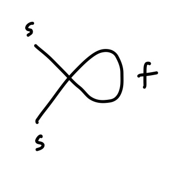
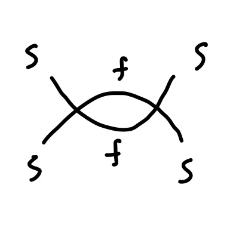

# 经典伊辛模型重整化群分析

经典伊辛模型可以通过 Hubbard-Stratonovich 变换变为实标量 $\phi^4$ 场论，因此伊辛模型的重整化群分析就是 $\phi^4$ 理论的重整化分析。

## Hubbard-Stratonovich 变换

经典伊辛模型哈密顿量写作：

$$
H= -J\sum_{\langle ij \rangle}s_i s_j - H \sum_i s_i.
$$

其中 $s_i$ 是取值为 $\pm1$ 的经典自旋，$J$ 是最近邻自旋耦合强度，$H$ 是(均匀)外场强度。系统配分函数为： 

$$
\begin{eqnarray}
Z &=& \sum_{\{s_i\}} \exp\left[\beta J\sum_{\langle ij \rangle}s_i s_j+ \beta H\sum_is_i \right] \\
&=:& \sum_{\{s_i\}} \exp\left[\sum_{ij} K_{ij}s_i s_j+ h\sum_i s_i \right].
\end{eqnarray}
$$

引入一个辅助(波色)场 $\psi$，根据高斯积分有：

$$
\begin{eqnarray}
\mathcal N 
&=& \int \mathcal D[\psi] e^{-\sum_{ij} \psi_i K_{ij}^{-1} \psi_j} \\
&=& \int \mathcal D[\psi] e^{-\sum_{ij} (\psi_i - K_{im}s_m)K_{ij}^{-1}(\psi_j - \sum_{n}K_{jn}s_n)} \\
&=& \int \mathcal D[\psi] e^{-\sum_{ij} \psi_i K_{ij}^{-1} \psi_j-\sum_{ij} s_i K_{ij} s_j + 2\sum_i s_i\psi_i}.
\end{eqnarray}
$$

其中 $\mathcal N$ 是一个归一化常数，H-S 变换首先将上述等式乘在陪分函数上，并做自旋求和：

$$
\begin{eqnarray}
Z
&=& \sum_{\{s_i\}} \int \mathcal D[\psi] e^{-\sum_{ij} \psi_i K_{ij}^{-1} \psi_j + \sum_i s_i(h+2\psi_i)} \\
&=& \mathcal N \int \mathcal D[\psi] e^{-\sum_{ij} (\psi_i-h/2) K_{ij}^{-1} (\psi_j -h/2)+\sum_i\ln[2\cosh(2\psi_i)]} \\
&=& \mathcal N \int \mathcal D[\psi] e^{-\sum_{ij} \psi_i K_{ij}^{-1} \psi_j +h\sum_{ij}K_{ij}^{-1}\psi_j+\sum_i\ln[2\cosh(2\psi_i)]}.
\end{eqnarray}
$$

定义另一个辅助(波色)场 $\phi$ :

$$
\phi_i = \sum_j K_{ij}^{-1} \psi_j.
$$

配分函数变为：

$$
\begin{eqnarray}
Z
&=& \int \mathcal D[\phi] e^{-\sum_{ij} \phi_i K_{ij} \phi_j +h\sum_{i}\phi_i+\sum_i\ln[\cosh(2\sum_j K_{ij}\phi_j)]}.
\end{eqnarray}
$$

为继续化简，考虑傅立叶变换：

$$
\phi_i = \frac{1}{\sqrt N}\sum_k e^{ikR_j} \phi_k,\ 
K_{ij} = \frac{1}{N} \sum_k e^{ik(R_i-R_j)} K(k).
$$

有恒等式：

$$
\begin{eqnarray}
\sum_{ij}\phi_i K_{ij} \phi_j &=& \sum_k \phi_{-k} \left(K_0+ \frac{K_2}{2}k^2 +O(k^4)\right) \phi_k, \\
\left(\sum_j K_{ij}\phi_j\right)_k &\approx& \left(K_0 + \frac{K_2}{2}k^2 +O(k^4)\right)\phi_k.
\end{eqnarray}
$$

对函数 $\ln[2\cosh(x)]$ 级数展开：

$$
\ln[2\cosh(x)] = \ln 2+ \frac{x^2}{2}-\frac{x^4}{12}+O(x^6).
$$

在动量空间得到：

$$
\begin{eqnarray}
\sum_i\ln[\cosh(2\sum_j K_{ij}\phi_j)] &=& 
2 \sum_k \left(K_0 + \frac{K_2}{2}k^2 \right)^2\phi_{-k}\phi_k 
-\frac{4}{3N}\sum_{k_1,k_2,k_3} \left(K_0 + \frac{K_2}{2}k^2 \right)^4 
\phi_{k_4}\phi_{k_3}\phi_{k_2}\phi_{k_1}\\
&=& 2\sum_k \phi_{-k}\left(K_0^2+K_0K_2k^2\right)\phi_k 
-\frac{4K_0^4}{3N} \sum_{k_1,k_2,k_3} \phi_{k_4}\phi_{k_3}\phi_{k_2}\phi_{k_1}
\end{eqnarray}
$$

我们最终关心的是系统的低能有效理论，故可忽略 $k$ 的高次项。最终作用量为：

$$
\begin{eqnarray}
S[\phi] &=& 
\sum_k \left(c_1+c_2 k^2 \right) \phi_{-k}\phi_k 
- h \phi_0
+ \frac{c_3}{N} \sum_{k_1,k_2,k_3} \phi_{k_4}\phi_{k_3}\phi_{k_2}\phi_{k_1} \\
&\simeq& \int d^d x \left[ c_1\phi^2-c_2 (\nabla \phi)^2 +c_3 \phi^4 - h\phi \right].
\end{eqnarray}
$$

其中系数为：

$$
\begin{eqnarray}
	c_1 &=& K_0(1-2K_0) \\
	c_2 &=& \frac{1}{2}K_2(1-4K_0) \\
	c_3 &=& \frac{4}{3}K_0^4
\end{eqnarray}
$$

这里我们对原来的格点模型做了连续化。这步形式上对应于：

$$
\frac{1}{N}\sum_k \simeq \int_0^{|k|<\Lambda} \frac{d^d k}{(2\pi)^d}
$$

同时将场重标度为 

$$
\phi_k \rightarrow \frac{1}{\sqrt N} \phi_k.
$$

最终得到的连续场是一个低能理论，其有一个来自于晶格常数的天然紫外截断 $\Lambda$. 许多时候，晶格常数被取为单位 1，这相当于取截断能量为自然的能量标度($\Lambda=1$)。为了形式上的简洁，可以再做一个重标度：

$$
\begin{eqnarray}
	\phi &\rightarrow& \frac{\phi}{\sqrt{2c_2}} \\
	h &\rightarrow& \frac{h}{\sqrt{2c_2}}
\end{eqnarray}
$$

并令

$$
r = \frac{c_1}{c_2},\ \lambda = \frac{6c_3}{c_2^2},
$$

此时作用量化为标准的 $\phi^4$ 理论作用量：

$$
S = \int d^d x \left[\frac{1}{2}(\nabla\phi)^2 + \frac{r}{2} \phi^2+\frac{\lambda}{4!}\phi^4 - h\phi\right].
$$

## 微扰重整化一般分析

首先将场分为低能 ($\phi_s$) 和高能 ($\phi_f$) 部分，作用量含有三部分：

$$
S[\phi] = S_s[\phi_s]+S_f[\phi_f]+S_I[\phi_s,\phi_f].
$$

分别是低能高能本身的作用量，以及其相互作用的贡献。重整化过程将高能部分积掉，只留下低能部分，得到低能有效理论。此过程中高能部分本身的作用量只贡献一个常数，因此可以忽略，最重要的是相互作用导致的贡献。形式上看，有效作用量定义为

$$
\begin{eqnarray}
e^{-S_{eff}[\phi_s]} &=& e^{-S_s[\phi_s]}\int \mathcal{D}[\phi_f] e^{-S_f[\phi_f]-S_I[\phi_s,\phi_f]} \\
&=& e^{-S_s[\phi_s]} \frac{\int \mathcal{D}[\phi_f] e^{-S_f[\phi_f]-S_I[\phi_s,\phi_f]}}{\int \mathcal{D}[\phi_f] e^{-S_f[\phi_f]}}\int \mathcal{D}[\phi_f] e^{-S_f[\phi_f]}.
\end{eqnarray}
$$

即：

$$
S_{eff}[\phi_s] = S_s[\phi]-\ln \langle e^{-S_I[\phi_s, \phi_f]} \rangle_f+S_f.
$$

忽略常数贡献，在二阶近似下，有效作用量为：

$$
S_{eff}[\phi_s] = S_s[\phi_s] + \langle S_I \rangle_f-\frac{1}{2} \left[ \langle S_I^2 \rangle_f-\langle S_I \rangle_f ^2 \right].
$$

## 自由场

首先分析自由场作用量：

$$
S_0[\phi] = \int_0^{|k|<\Lambda} \frac{d^d k}{(2\pi)^d} k^2 \phi_{-k} \phi_k.
$$

定义动量在 $0<|k|<\Lambda/s$ 的部分为低能部分，相应地，动量在 $\Lambda/s < |k| < \Lambda$ 的部分为高能部分。对自由场，低能高能部分没有相互作用，因此积掉高能部分得到的有效理论和原来形式完全一样，因此自由场本身是一个重整化不动点(高斯不动点)。为了使低能理论和原先完全一样，我们需要做重标度。首先看到低能作用量为： 

$$
S_0'[\phi^s] = \int_0^{|k|<\Lambda/s} \frac{d^d k}{(2\pi)^d} k^2 \phi^s_{-k} \phi^s_{k}.
$$

首先对动量重标度 $k'=sk$:

$$
S_0'[\phi^s] = s^{-d-2} \int_0^{|k'|<\Lambda} \frac{d^d k'}{(2\pi)^d} k'^2 \phi^s_{-k'/s} \phi^s_{k'/s}.
$$

再对场作重标度 $\phi'_{k} = s^{-d/2-1}\phi^s_{k/s}$, 得到：

$$
S'_0[\phi_s] = \int_0^{|k|<\Lambda} \frac{d^d k}{(2\pi)^d} k^2 \phi'_{-k} \phi'_{k}.
$$

即，自由场确定了一个标度变换：

$$
\begin{eqnarray}
k &\rightarrow& k/s, \\
\phi &\rightarrow& s^{d/2+1}\phi.
\end{eqnarray}
$$

我们可以考虑作用量中不同的项在此重标度下的变化，来判断这些项是否是重要(relevant/irrelevant)的。

首先考虑外场项 $-h \phi_0$, 重标度导致：

$$
h \rightarrow s^{d/2+1}h.
$$

因此外场总是重要的。对于场 $\phi$ 的二次型：

$$
\int_0^{|k|<\Lambda} \frac{d^d k}{(2\pi)^d} r(k)\phi^*(k)\phi(k) = \int_0^{|k|<\Lambda} \frac{d^d k}{(2\pi)^d}(r_0 + r_2 k^2+r_4k^4+\cdots)\phi^*(k)\phi(k),
$$

重标度后：

$$
\begin{eqnarray}
r_0 &\rightarrow& s^2 r_0, \\
r_2 &\rightarrow& r_2, \\
r_4 &\rightarrow& r_4/s^2.
\end{eqnarray}
$$

我们看到对于 $k$ 大于 4 次的项总是不重要的。对于四次相互作用项(常数耦合)

$$
u_0 \int_0^{|k|<\Lambda}\phi^*(k_4)\phi^*(k_3) \phi(k_2)\phi(k_1) \prod_{i=1}^3 \frac{d^dk_i}{(2\pi)^d}.
$$

重标度后耦合常数变化为

$$
u_0 \rightarrow s^{4-d} u_0.
$$

如果考虑更一般含 $k$ 的多项式耦合

$$
u(k_1,k_2,k_3,k_4)
$$

根据上述分析我们可以看到它们比起常数部分更加 irrelevant，因此对于低能理论，我们可以只考虑常数耦合。

## 一阶微扰

一阶微扰下，对相互作用积掉高能场得到的有效作用量贡献可以用费曼图表示为：

此图有对称因子 $C_4^2 = 6 $，因此表达式为：

$$
\begin{eqnarray}
S_I^{(1)} &=& 6\frac{\lambda}{4!} \phi^s_{-k}\phi^s_{k} \int_{\Lambda/s}^\Lambda \frac{d^d k}{(2\pi)^d} \frac{1}{k^2+r} \\
&=& \frac{r'_0}{2} \phi^s_{-k} \phi^s_{k}.
\end{eqnarray}
$$

我们最终需要求的重整化群方程是个微分方程。相当于在 $|k|\sim \Lambda$ 附近的薄能壳附近做积分，这步操作实际上不需要做积分。令 $s = e^{dl} \simeq 1+dl$,

$$
\begin{eqnarray}
r'_0 &=& \frac{\lambda}{2} \int_{\Lambda(1-dl)}^{\Lambda} \frac{d k}{(2\pi)^d} \frac{k^{d-1}S_d}{k^2+r} \\
&=& \frac{\lambda\Lambda^d S_d}{2(2\pi)^d} \frac{dl}{\Lambda^2+r} \\
&=:& \frac{A_d\lambda}{1+r} dl
\end{eqnarray}
$$

其中我们已经令 $\Lambda=1$，同时 $d$ 维球面系数为：

$$
S_d = \frac{2\pi^{\frac{d}{2}}}{\Gamma\left(\frac{d}{2}\right)}.
$$

即

$$
A_d = \frac{1}{2^{d} \pi^{d/2} \Gamma(d/2)}.
$$

重标度后：

$$
\begin{eqnarray}
S_{eff} &=& \int_0^{|k|<\Lambda} \frac{d^d k}{(2\pi)^d} 
\phi^s_{-k} \left(\frac{k^2+s^2r+s^2r'_0}{2}\right)  \phi^s_{k} +
\frac{\lambda s^{4-d}}{4!} \int_0^{|k|<\Lambda} 
\phi^*(k_4)\phi^*(k_3) \phi(k_2)\phi(k_1) \prod_{i=1}^3 \frac{d^dk_i}{(2\pi)^d} \\
&=& S + 
dl\int_0^{|k|<\Lambda} \frac{d^d k}{(2\pi)^d}
\phi^s_{-k} \left(\frac{r+A_d \lambda/(1+r)}{2} \right) \phi^s_{k}+
\frac{\lambda}{4!}(4-d)dl \int_0^{|k|<\Lambda} \phi^s_{k_4}\phi^s_{k_3} \phi^s_{k_2}\phi^s_{k_1} \prod_{i=1}^3 \frac{d^dk_i}{(2\pi)^d}.
\end{eqnarray}
$$

最后的重整化方程为：

$$
\begin{eqnarray}
	\frac{d r}{dl} &=& 2 r + \frac{A_d}{1+r} \lambda, \\
	\frac{d \lambda}{dl} &=& (4-d) \lambda.
\end{eqnarray}
$$

此时重整化不动点仍在 $(r,\lambda)=(0,0)$ 处。

## 二阶微扰

考虑二阶微扰，对应图为：

此图含有对称因子 $2\times(C_4^2)^2=72$, 表达式为

$$
\begin{eqnarray}
S_I^{(2)} &=& \left(72\frac{\lambda^2}{2(4!)^2}\int_{|k|<\Lambda(1-dl)}^{|k|<\Lambda}\frac{k^{d-1}S_ddk}{(2\pi)^d(k^2+r)^2} \right) \int_0^{|k|<\Lambda/s} \phi^s_{k_4}\phi^s_{k_3} \phi^s_{k_2}\phi^s_{k_1} \prod_{i=1}^3 \frac{d^dk_i}{(2\pi)^d} \\
&=& \frac{\lambda'}{4!} \int_0^{|k|<\Lambda/s} \phi^s_{k_4}\phi^s_{k_3} \phi^s_{k_2}\phi^s_{k_1} \prod_{i=1}^3 \frac{d^dk_i}{(2\pi)^d},
\end{eqnarray}
$$

其中

$$
\lambda' = 3A_d \lambda^2 dl.
$$

重标度后，这部分贡献为：

$$
\lambda' s^{4-d} = 3A_d \lambda^2 dl + O(dl^2). 
$$

由此得到：

$$
\frac{d\lambda}{dl} = (4-d)\lambda -3A_d\lambda^2.
$$

对 $d=3$ 情形，首先设 $\epsilon=4-d \ll 1$，再解析延拓到 $\epsilon=1$ 得到结果。
