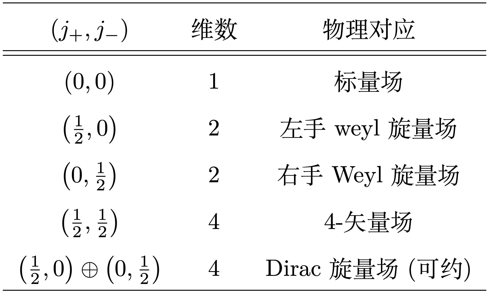

# 洛伦兹群的旋量表示

首先简要介绍下本文的 motivation. 本人是凝聚态学生，之前一直将场论理解为二次量子化下的多体物理。在学习量子场论的过程中，对将不同的场归结为洛伦兹群的表示这一观点感到十分惊艳。然而感觉
Weinberg 语言过于数学化与晦涩，其他常规场论书(Peskin 等)几乎只是讲了个故事，从表示到场论逻辑较为跳跃。希望用较为具体的语言，整理洛伦兹群的旋量表示及各种推论。

## 无穷小洛伦兹变换

我们采用 $\eta_{\mu\nu}=diag\left(1,-1,-1,-1\right)$ 度规。洛伦兹矩阵是在合同变换下保持洛伦兹度规不变的(实)矩阵：

$$
\Lambda^{T}\left(\begin{array}{cccc}
1\\
 & -1\\
 &  & -1\\
 &  &  & -1
\end{array}\right)\Lambda=\left(\begin{array}{cccc}
1\\
 & -1\\
 &  & -1\\
 &  &  & -1
\end{array}\right).
$$

满足上述关系的矩阵组成一个(连续)矩阵群。在单位矩阵附近，我们考虑一些无穷小元素 ${\left(\delta\omega\right)^{\mu}}_{\nu}$ :

$$
\begin{eqnarray}
{\Lambda^{\mu}}_{\nu} & \eqsim & {\delta^{\mu}}_{\nu}+{\left(\delta\omega\right)^{\mu}}_{\nu},\\
{\left(\Lambda^{T}\right)_{\mu}}^{\nu} & \eqsim & {\delta_{\mu}}^{\mu}+{\left(\delta\omega^{T}\right)_{\mu}}^{\nu}.
\end{eqnarray}
$$

洛伦兹群关系要求：

$$
\begin{eqnarray}
\eta_{\mu\nu} & = & \left({\delta_{\mu}}^{\rho}+{\left(\delta\omega\right)^{\mu}}_{\nu}\right)\eta_{\rho\sigma}\left({\delta^{\sigma}}_{\nu}+{\left(\delta\omega^{T}\right)_{\mu}}^{\nu}\right)\nonumber \\
 & \eqsim & \eta_{\mu\nu}+{\left(\delta\omega\right)^{\mu}}_{\nu}\eta_{\rho\sigma}{\delta^{\sigma}}_{\nu}+{\delta_{\mu}}^{\rho}\eta_{\rho\sigma}{\left(\delta\omega^{T}\right)_{\mu}}^{\nu}\nonumber \\
 & = & \eta_{\mu\nu}+\left(\delta\omega\right)_{\mu\nu}+\left(\delta\omega^{T}\right)_{\mu\nu}.
\end{eqnarray}
$$

因此洛伦兹群上无穷小元素的限制是反对称：$\delta\omega_{\mu\nu}=-\delta\omega_{\nu\mu}$.
这里无穷小矩阵两个下指标，为了写出通常意义下的矩阵形式，最好将其一个指标用度规提升：

$$
{\left(\delta\omega\right)^{\mu}}_{\nu}=\eta^{\mu\sigma}\left(\delta\omega\right)_{\sigma\nu}.
$$

而 4 维反对称实矩阵只有 6 个自由度，每个自由度的生成元矩阵为：

$$
L^{1}=\left(\begin{array}{cccc}
0 & 0 & 0 & 0\\
0 & 0 & 0 & 0\\
0 & 0 & 0 & -1\\
0 & 0 & 1 & 0
\end{array}\right),\ L^{2}=\left(\begin{array}{cccc}
0 & 0 & 0 & 0\\
0 & 0 & 0 & 1\\
0 & 0 & 0 & 0\\
0 & -1 & 0 & 0
\end{array}\right),\ L^{3}=\left(\begin{array}{cccc}
0 & 0 & 0 & 0\\
0 & 0 & -1 & 0\\
0 & 1 & 0 & 0\\
0 & 0 & 0 & 0
\end{array}\right).
$$

$$
K^{1}=\left(\begin{array}{cccc}
0 & 1 & 0 & 0\\
1 & 0 & 0 & 0\\
0 & 0 & 0 & 0\\
0 & 0 & 0 & 0
\end{array}\right),\ K^{2}=\left(\begin{array}{cccc}
0 & 0 & 1 & 0\\
0 & 0 & 0 & 0\\
1 & 0 & 0 & 0\\
0 & 0 & 0 & 0
\end{array}\right),\ K^{3}=\left(\begin{array}{cccc}
0 & 0 & 0 & 1\\
0 & 0 & 0 & 0\\
0 & 0 & 0 & 0\\
1 & 0 & 0 & 0
\end{array}\right).
$$

其中第二行 3 个矩阵由于乘上度规因子变为对称矩阵。这六个无穷小矩阵有直接的物理意义：第一行 3 个矩阵对应 3 个方向的空间转动，第二行
3 个矩阵对应 3 个方向的洛伦兹 boost。我们将三个空间转动的无穷小系数记为 $\left(\theta_{1},\theta_{2},\theta_{3}\right)$，三个
boost 方向无穷小系数记为 $\left(\beta_{1},\beta_{2},\beta_{3}\right)$. 一般的洛伦兹变换可以写为一个指数形式：

$$
\Lambda\left(\vec{\theta},\vec{\beta}\right)=\exp\left(\vec{\theta}\cdot\vec{J}+\vec{\beta}\cdot\vec{K}\right).
$$

## 洛伦兹代数
对于连续群，李氏定理告诉我们只要确定生成元直接的对易关系，相应连续群的局部结果就完全确定了。我们因此考虑洛伦兹群 6 个生成元的对易关系。

要确定这些对易关系，原则上我们可以将矩阵两两相乘再相减。这里直接给出结果：

$$
\begin{eqnarray}
\left[L^{i},L^{j}\right] & = & \epsilon^{ijk}L^{k},\\
\left[K^{i},K^{j}\right] & = & -\epsilon^{ijk}L^{k},\\
\left[L^{i},K^{j}\right] & = & \epsilon^{ijk}K^{k}.
\end{eqnarray}
$$

据此构造两组算符：

$$
\begin{eqnarray}
J_{+}^{i} & = & \frac{1}{2}\left(L^{i}+iK^{i}\right),\\
J_{-}^{i} & = & \frac{1}{2}\left(L^{i}-iK^{i}\right).
\end{eqnarray}
$$

其中可以验证两组算符之间的对易关系为 0 :

$$
\begin{eqnarray}
\left[J_{+}^{i},J_{-}^{j}\right] & = & \frac{1}{4}\left[L^{i}+iK^{i},L^{j}-iK^{j}\right]\nonumber \\
 & = & \frac{1}{4}\left(i\epsilon^{ijk}L^{k}+\epsilon^{ijk}K^{k}-\epsilon^{ijk}K^{k}-i\epsilon^{ijk}L^{k}\right)\nonumber \\
 & = & 0.
\end{eqnarray}
$$

而每组算符内部分别满足 $SU(2)$ 生成元的对易关系：

$$
\begin{eqnarray}
\left[J_{+}^{i},J_{+}^{j}\right] & = & \frac{1}{4}\left[L^{i}+iK^{i},L^{j}+iK^{j}\right]\nonumber \\
 & = & \frac{1}{4}\left(i\epsilon^{ijk}L^{k}-\epsilon^{ijk}K^{k}-\epsilon^{ijk}K^{k}+i\epsilon^{ijk}L^{k}\right)\nonumber \\
 & = & \frac{i}{2}\epsilon^{ijk}\left(L^{k}+iK^{k}\right)\nonumber \\
 & = & \frac{i}{2}\epsilon^{ijk}J_{+}^{k}.
\end{eqnarray}
$$

$$
\begin{eqnarray}
\left[J_{-}^{i},J_{-}^{j}\right] & = & \frac{1}{4}\left[L^{i}-iK^{i},L^{j}-iK^{j}\right]\nonumber \\
 & = & \frac{1}{4}\left(i\epsilon^{ijk}L^{k}+\epsilon^{ijk}K^{k}+\epsilon^{ijk}K^{k}+i\epsilon^{ijk}L^{k}\right)\nonumber \\
 & = & \frac{i}{2}\epsilon^{ijk}\left(L^{k}-iK^{k}\right)\nonumber \\
 & = & \frac{i}{2}\epsilon^{ijk}J_{-}^{k}.
\end{eqnarray}
$$

因此，洛伦兹群的生成元可以被分为无关的两组满足 $SU(2)$ 代数的生成元，或者说存在李代数同构：

$$
so(1,3)\approx su(2)\otimes su(2).
$$

利用 $su(2)$ 的全部(不可约)表示，我们在李代数意义下得到了洛伦兹群的全部(不可约)表示。我们用 $\left(j_{+},j_{-}\right)$
标记每个不可约表示，对应表示的维数为 $\left(2j_{+}+1\right)\left(2j_{-}+1\right)$,
我们可以列出最简单的几个表示和其物理对应：

下面我们着眼于每个具体的表示。

## Weyl 旋量表示

我们首先讨论最简单的非平庸表示 $\left(\frac{1}{2},0\right)$, 即左手 Weyl 旋量场。这是一个二维表示，我们用一个具体写出表示空间的一个矢量：

$$
\psi_{L}=\left(\begin{array}{c}
\psi_{L}^{1}\\
\psi_{L}^{2}
\end{array}\right).
$$

在洛伦兹变换下，此旋量场的变换为：

$$
\psi_{L}^{i}\rightarrow{\left(\Lambda_{L}\right)^{i}}_{j}\psi_{L}^{j}.
$$

其中 $\Lambda_{L}$ 为一个 $2\times2$ 维矩阵，对应 $\left(\frac{1}{2},0\right)$
表示的表示矩阵。要确定表示矩阵，我们注意到 $j_{-}=0$, 即第二个“自旋”为 0 ，用我们之前确定的生成元关系，有：

$$
J_{-}^{i}\psi=0,\ \forall i.
$$

由此我们得到关于生成元的一个限制关系：

$$
J_{-}^{i}=\frac{1}{2}\left(J^{i}-iK^{i}\right)=0.
$$

而对于另一组生成元：

$$
J_{+}^{i}\psi=\frac{1}{2}\left(J^{i}+iK^{i}\right)\psi=J_{-}^{i}\psi.
$$

此时，由于 $J_{-}^{i}$ 满足 $su(2)$ 的对易关系，我们可以用泡利矩阵表示之(这里我们插入 i 使得生成元幺正)：

$$
iJ^{i}=iJ_{-}^{i}=\sigma^{i};
$$

$$
iK^{i}=J_{-}^{i}=-i\sigma^{i}.
$$

这样我们就确定了 $\left(\frac{1}{2},0\right)$ 的表示矩阵：

$$
\Lambda_{L}=e^{\frac{1}{2}\left(-i\vec{\theta}-\vec{\beta}\right)\cdot\vec{\sigma}}.
$$

我们看到表示矩阵像一个 $SU(2)$, 不过 boost 对应一个虚数转角。用同样的方法，我们可以得到 $\left(0,\frac{1}{2}\right)$
表示对应的矩阵：

$$
\Lambda_{R}=e^{\frac{1}{2}\left(-i\vec{\theta}+\vec{\beta}\right)\cdot\vec{\sigma}}.
$$

这样，我们确定了洛伦兹群两个不等价二维不可约表示。在我们转而考虑更高维表示之前，我们先来看两个 Weyl 旋量表示的关系。

从指数矩阵的形式上看，左手右手的差别在于 boost 生成元的符号。我们可以用一个小 trick 将互换左右手表示。首先我们注意到共轭作用
$\sigma^{2}$ 有翻转自旋的效果(同时产生一个复共轭)：

$$
\sigma^{2}\vec{\sigma}\sigma^{2}=-\vec{\sigma}^{*}.
$$

因此左右手表示存在关系：

$$
\begin{eqnarray}
\sigma^{2}\Lambda_{L}^{*}\sigma^{2} & = & \Lambda_{R},\\
\sigma^{2}\Lambda_{R}^{*}\sigma^{2} & = & \Lambda_{L}.
\end{eqnarray}
$$

我们发现，将左手矢量做变换：

$$
\psi_{L}\rightarrow-i\sigma^{2}\psi_{L}^{*}.
$$

变换后的矢量在洛伦兹变换下像右手旋量空间的矢量那样变化：

$$
\begin{eqnarray}
-i\sigma^{2}\psi_{L}^{*} & \rightarrow & -i\sigma^{2}\Lambda_{L}^{*}\psi_{L}^{*}\nonumber \\
 & = & -i\sigma^{2}\Lambda_{L}^{*}\sigma^{2}\sigma^{2}\psi_{L}^{*}\nonumber \\
 & = & \Lambda_{R}\left(-i\sigma^{2}\psi_{L}^{*}\right).
\end{eqnarray}
$$

这个操作很像一个时间反演操作。因此，利用“时间反演”，我们有左右手表示的转换关系：

$$
\begin{eqnarray}
\psi_{R} & \eqsim & -i\sigma^{2}\psi_{L}^{*},\\
\psi_{L} & \eqsim & -i\sigma^{2}\psi_{R}^{*}.
\end{eqnarray}
$$

另一方面，对于一个手征的表示，以左手为例，我们可以用一个全反对称符号下降指标得到对偶矢量

$$
\psi_{L,i}=\epsilon_{ij}\psi_{L}^{j}=\left(\begin{array}{c}
\psi_{L}^{2}\\
-\psi_{L}^{1}
\end{array}\right).
$$

这是一个方便的记号，我们可以验证表示矢量与其对偶矢量缩并是一个洛伦兹不变量：

$$
\begin{eqnarray}
\psi_{L,i}\psi_{L}^{i} & = & \epsilon_{ij}\psi_{L}^{i}\psi_{L}^{j}\nonumber \\
 & \rightarrow & \epsilon_{ij}{\left(\Lambda_{L}\right)^{i}}_{k}{\left(\Lambda_{L}\right)^{j}}_{l}\psi_{L}^{k}\psi_{L}^{l}\nonumber \\
 & = & \det\left(\Lambda_{L}\right)\epsilon_{kl}\psi_{L}^{k}\psi_{L}^{l}\nonumber \\
 & = & \psi_{L,i}\psi_{L}^{i}.
\end{eqnarray}
$$

注意到 $\epsilon_{ij}=\left(i\sigma^{2}\right)_{ij}$, 因此这个洛伦兹不变量又可表示为：

$$
\begin{eqnarray}
\psi_{L,i}\psi_{L}^{i} & = & i\psi_{L}^{T}\sigma^{2}\psi_{L}\nonumber \\
 & = & \left(-i\sigma^{2}\psi_{L}^{*}\right)^{\dagger}\psi_{L}\nonumber \\
 & \eqsim & \psi_{R}^{\dagger}\psi_{L}.
\end{eqnarray}
$$

## 矢量表示
现在我们来考虑 $\left(\frac{1}{2},\frac{1}{2}\right)$ 不可约表示。实际上，从矩阵的维数就可以看出这是这对应洛伦兹群的自身表示，因为洛伦兹群只有一个
4 维不可约表示。但我们在这里具体将这个 4-矢量写出来。

首先， $\left(\frac{1}{2},\frac{1}{2}\right)$ 表示可以写成左手 Weyl 旋量与右手 Weyl
旋量表示的直积：

$$
\left(\frac{1}{2},\frac{1}{2}\right)=\left(\frac{1}{2},0\right)\otimes\left(0,\frac{1}{2}\right).
$$

这启发我们用之前得到的二维表示来构造这个四维表示。我们可以用矢量直乘写出表示空间的矢量：

$$
\psi=\psi_{L}\otimes\psi_{R}=\left(\begin{array}{c}
\psi_{L}^{1}\psi_{R}^{1}\\
\psi_{L}^{1}\psi_{R}^{2}\\
\psi_{L}^{2}\psi_{R}^{1}\\
\psi_{L}^{2}\psi_{R}^{2}
\end{array}\right).
$$

同样地，表示矩阵可以写为两个矩阵直乘。表示空间中矢量变换关系写为：

$$
\Lambda_{\left(\frac{1}{2},\frac{1}{2}\right)}\psi=\left(\Lambda_{L}\otimes\Lambda_{R}\right)\psi.
$$

到这里，原则上我们已经具体给出了这个表示，但我们不满足于此。我们还希望直接看出 4-矢量变换来，这里我们就要用到旋量表示的“换手”trick：在直乘表达式中，我们让
$\psi_{R}$ 躺下，即将直乘变为外积：

$$
M=\psi_{L}\cdot\psi_{R}^{T}=\left(\begin{array}{cc}
\psi_{L}^{1}\psi_{R}^{1} & \psi_{L}^{1}\psi_{R}^{2}\\
\psi_{L}^{2}\psi_{R}^{1} & \psi_{L}^{2}\psi_{R}^{2}
\end{array}\right).
$$

我们看到，我们没改变 4 分量的任何一个，不过是对矢量做了个变形。我们用这个变形后矩阵承载 $\left(\frac{1}{2},\frac{1}{2}\right)$
表示。其在洛伦兹变换下的变换形式现在变为：

$$
M\rightarrow\Lambda_{L}M\Lambda_{R}^{T}.
$$

转置的结果相当于取 $\vec{\sigma}\rightarrow\vec{\sigma}^{*}$. 这启发我们在插入一个 $\sigma^{2}$
矩阵：

$$
\begin{eqnarray}
M\sigma^{2} & \rightarrow & \Lambda_{L}M\sigma^{2}\left(\sigma^{2}\Lambda_{R}^{T}\sigma^{2}\right)\nonumber \\
 & = & \Lambda_{L}\left(M\sigma^{2}\right)\bar{\Lambda}_{R}.
\end{eqnarray}
$$

其中：

$$
\bar{\Lambda}_{R}=\Lambda_{R}=e^{\frac{1}{2}\left(i\vec{\theta}-\vec{\beta}\right)\cdot\vec{\sigma}}.
$$

而新定义的矩阵可以写为：

$$
\begin{eqnarray}
M\sigma^{2} & = & \psi_{L}\cdot\psi_{R}^{T}\sigma^{2}\nonumber \\
 & = & \psi_{L}\cdot\left(\sigma^{2}\psi_{R}^{*}\right)^{\dagger}\nonumber \\
 & = & i\psi_{L}\cdot\psi_{L}^{\dagger}.
\end{eqnarray}
$$

我们可以将矩阵 $M\sigma^{2}$ 参数化为：

$$
M\sigma^{2}=\left(\begin{array}{cc}
V^{0}-V^{3} & -V^{1}+iV^{2}\\
-V^{1}-iV^{2} & V^{0}+V^{3}
\end{array}\right).
$$

我们所期待的 4-矢量 $V^{\mu}$ 已经出现了。可以验证在洛伦兹变换下它的确像 4-矢量那样变换。要说吗这点，我们考虑一个无穷小变换：

$$
\begin{eqnarray}
T_{L}MT_{R} & = & \left(1-\frac{i}{2}\theta_{i}\sigma^{i}-\frac{1}{2}\beta_{i}\sigma^{i}\right)\left(V^{0}-V^{i}\sigma^{i}\right)\left(1+\frac{i}{2}\theta_{i}\sigma^{i}-\frac{1}{2}\beta_{i}\sigma^{i}\right)\nonumber \\
 & = & V^{0}-V^{i}\sigma^{i}-\beta_{i}\sigma^{i}V^{0}+\frac{i}{2}\theta_{i}V^{j}\left[\sigma^{i},\sigma^{j}\right]+\frac{1}{2}\beta_{i}V^{j}\left\{ \sigma^{i},\sigma^{j}\right\} \nonumber \\
 & = & V^{0}-V^{i}\sigma^{i}-\beta_{i}\sigma^{i}V^{0}-\epsilon^{ijk}\theta_{i}V^{j}\sigma^{k}+\beta_{i}V^{i}\nonumber \\
 & = & \left(V^{0}+\beta_{i}V^{i}\right)-\left(V^{i}+\beta_{i}V^{0}+\epsilon^{ijk}\theta_{j}V^{k}\right)\sigma^{i}.
\end{eqnarray}
$$

我们可以将其与矢量无穷小洛伦兹变换比对：

$$
\left(\begin{array}{cccc}
1 & \beta_{1} & \beta_{2} & \beta_{3}\\
\beta_{1} & 1 & -\theta_{3} & \theta_{2}\\
\beta_{2} & \theta_{3} & 1 & -\theta_{1}\\
\beta_{3} & -\theta_{2} & \theta_{1} & 1
\end{array}\right)\left(\begin{array}{c}
V^{0}\\
V^{1}\\
V^{2}\\
V^{3}
\end{array}\right)=\left(\begin{array}{c}
V^{0}+\beta_{1}V^{1}+\beta_{2}V^{2}+\beta_{3}V^{3}\\
V^{1}+\beta_{1}V^{0}+\theta_{2}V^{3}-\theta_{3}V^{2}\\
V^{2}+\beta_{2}V^{0}+\theta_{3}V^{1}-\theta_{1}V^{3}\\
V^{3}+\beta_{3}V^{0}+\theta_{1}V^{2}-\theta_{2}V^{1}
\end{array}\right).
$$

发现 $V^{\mu}$ 的确像 4-矢量那样变换。我们将 $\psi_{L}\cdot\psi_{L}^{\dagger}$
具体乘开成矩阵形式并与参数化的矩阵比较：

$$
\left(\begin{array}{cc}
\psi_{L}^{1}\psi_{L}^{*1} & \psi_{L}^{1}\psi_{L}^{*2}\\
\psi_{L}^{2}\psi_{L}^{*1} & \psi_{L}^{2}\psi_{L}^{*2}
\end{array}\right)=\left(\begin{array}{cc}
V^{0}-V^{3} & -V^{1}+iV^{2}\\
-V^{1}-iV^{2} & V^{0}+V^{3}
\end{array}\right).
$$

可以得到：

$$
V^{\mu}=i\psi_{L}^{\dagger}\bar{\sigma}^{\mu}\psi_{L}.
$$

其中：

$$
\bar{\sigma}^{\mu}:=\left(1,-\sigma^{1},-\sigma^{2},-\sigma^{3}\right).
$$

当然，我们可以利用左右手表示的转换得到 4-矢量的另一个表达式：

$$
V^{\mu}=i\psi_{R}^{\dagger}\sigma^{\mu}\psi_{R}.
$$

其中：

$$
\sigma^{\mu}:=\left(1,\sigma^{1},\sigma^{2},\sigma^{3}\right).
$$

## 洛伦兹不变性
在讨论 Dirac (可约)表示之前，我们来考虑目前为止我们讨论的表示对应的场。量子场论的基本原则是想办法构造满足洛伦兹不变的场拉氏量。

我们同样从最简单的情况开始，考虑左手 weyl 表示可能对应的场拉氏量。首先，对于旋量场，我们希望拉氏量含有场的一阶导数，而导数算符作用在场上有逆变矢量的变换规律，有了之前的铺垫，我们自然想到用
$\sigma^{\mu}$与其缩并得到洛伦兹不变的动能项：

$$
i\psi_{L}^{\dagger}\bar{\sigma}^{\mu}\partial_{\mu}\psi_{L}.
$$

这就对应了 Weyl 场拉氏量，对应零质量情形。考虑质量，我们就要在拉氏量中加入质量项，直接的想法是模仿 Klein-Gordon
方程加入类似于 $\psi_{L}^{\dagger}m\psi_{L}$ 的项，可惜这不是洛伦兹不变的。

幸运的是，对于旋量表示的矢量，我们已经提到过，可以用对偶矢量

$$
\psi_{i}:=\epsilon_{ij}\psi^{j}=\left(i\sigma^{2}\right)_{ij}\psi^{i}
$$

缩并得到一个洛伦兹标量：

$$
\psi_{Li}\psi_{L}^{i}=i\psi_{L}^{T}\sigma^{2}\psi_{L}.
$$

因此，我们可以写下拉氏量：

$$
{\cal L}=i\psi_{L}^{\dagger}\sigma^{\mu}\partial_{\mu}\psi_{L}+im\psi_{L}^{T}\sigma^{2}\psi_{L}.
$$

到这里，我们似乎已经得到了想要的带质量的洛伦兹不变拉氏量。但这个拉氏量有一个严重的问题，即它的质量项没有 $U(1)$ 对称性，即在变换
$\psi_{L}\rightarrow e^{i\theta}\psi_{L}$ 下质量项改变。这个困难可以通过一个复对称化操作解决：

$$
\begin{eqnarray}
\mathcal{L}' & = & \frac{1}{2}\left(\mathcal{L}+\mathcal{L}^{*}\right)\nonumber \\
 & = & i\chi^{\dagger}\bar{\sigma}^{\mu}\partial_{\mu}\chi+\frac{i}{2}m\left(\chi^{T}\sigma^{2}\chi-\chi^{\dagger}\sigma^{2}\chi^{*}\right).
\end{eqnarray}
$$

这里我们将 $\psi_{L}$ 替换为 $\chi$, 这个拉氏量就是 Majorana 拉氏量。Majorana 可以看作
Dirac 表示的一种等价变形。这里由于场是复的，实际上体系表示空间是 4 维的。这也启发我们写下一个 4 维表示。最直接的思路是把左右手表示放在一起：

$$
\begin{eqnarray}
\mathcal{L}_{L} & = & i\psi_{L}^{\dagger}\bar{\sigma}^{\mu}\partial_{\mu}\psi_{L}+\frac{i}{2}m\left(\psi_{L}^{T}\sigma^{2}\psi_{L}-\psi_{L}^{\dagger}\sigma^{2}\psi_{L}^{*}\right),\\
\mathcal{L}_{R} & = & i\psi_{R}^{\dagger}\sigma^{\mu}\partial_{\mu}\psi_{R}+\frac{i}{2}m\left(\psi_{R}^{T}\sigma^{2}\psi_{R}-\psi_{R}^{\dagger}\sigma^{2}\psi_{R}^{*}\right).
\end{eqnarray}
$$

在质量项上，做变换：$\psi_{R}\eqsim-i\sigma^{2}\psi_{L}^{*},\ \psi_{L}\eqsim-i\sigma^{2}\psi_{R}^{*}$:

$$
\begin{eqnarray}
\mathcal{L} & = & \mathcal{L}_{L}+\mathcal{L}_{R}\nonumber \\
 & \eqsim & i\psi_{L}^{\dagger}\sigma^{\mu}\partial_{\mu}\psi_{L}+i\psi_{R}^{\dagger}\sigma^{\mu}\partial_{\mu}\psi_{R}-m\left(\psi_{L}^{\dagger}\psi_{R}+\psi_{R}^{\dagger}\psi_{L}\right).
\end{eqnarray}
$$

并合并左右手旋量为 $\psi:=\left(\psi_{L},\psi_{R}\right)^{T}$:

$$
\mathcal{L}=\psi^{\dagger}\left(\begin{array}{cc}
i\sigma^{\mu}\partial_{\mu} & -m\\
-m & i\sigma^{\mu}\partial_{\mu}
\end{array}\right)\psi.
$$

我们就得到了 Dirac 场拉氏量。

## Dirac 表示
现在我们知道，引入 $\left(\frac{1}{2},0\right)\oplus\left(0,\frac{1}{2}\right)$
这个可约表示的目的是描述电子拉氏量，表示空间是左右手 Weyl 旋量表示矢量直和：

$$
\psi=\left(\begin{array}{c}
\psi_{L}^{1}\\
\psi_{L}^{2}\\
\psi_{R}^{1}\\
\psi_{R}^{2}
\end{array}\right).
$$

表示矩阵也就是相应两个旋量表示直和：

$$
\Lambda_{Dirac}=\left(\begin{array}{cc}
\Lambda_{L} & 0\\
0 & \Lambda_{R}
\end{array}\right).
$$

我们在构造洛伦兹不变拉氏量时实际就已经得到了这个表示。这里我们可以将其写的更加洛伦兹不变些。在旋量表示一节中，我们知道了两组旋量构成的洛伦兹不变量：$\psi_{R}^{\dagger}\psi_{L},\psi_{L}^{\dagger}\psi_{R}$，这启发我们定义矩阵：

$$
\gamma^{0}=\left(\begin{array}{cc}
0 & \vec{1}\\
\vec{1} & 0
\end{array}\right).
$$

并定义：

$$
\bar{\psi}:=\psi^{\dagger}\gamma^{0}.
$$

这样洛伦兹不变量写为了紧凑形式：$\bar{\psi}\psi$. 另一方面，4-矢量表示可以写为：

$$
\begin{eqnarray}
V^{\mu} & = & \left(\begin{array}{cc}
\psi_{L}^{\dagger} & \psi_{R}^{\dagger}\end{array}\right)\left(\begin{array}{cc}
\bar{\sigma}^{\mu} & 0\\
0 & \sigma^{\mu}
\end{array}\right)\left(\begin{array}{c}
\psi_{L}\\
\psi_{R}
\end{array}\right)\nonumber \\
 & = & \left(\begin{array}{cc}
\psi_{L}^{\dagger} & \psi_{R}^{\dagger}\end{array}\right)\left(\begin{array}{cc}
0 & \vec{1}\\
\vec{1} & 0
\end{array}\right)\left(\begin{array}{cc}
0 & \vec{1}\\
\vec{1} & 0
\end{array}\right)\left(\begin{array}{cc}
\bar{\sigma}^{\mu} & 0\\
0 & \sigma^{\mu}
\end{array}\right)\left(\begin{array}{c}
\psi_{L}\\
\psi_{R}
\end{array}\right)\nonumber \\
 & = & \bar{\psi}\left(\begin{array}{cc}
0 & \sigma^{\mu}\\
\bar{\sigma}^{\mu} & 0
\end{array}\right)\psi.
\end{eqnarray}
$$

我们定义另外几个 gamma 矩阵：

$$
\gamma^{i}=\left(\begin{array}{cc}
0 & \sigma^{i}\\
-\sigma^{i} & 0
\end{array}\right).
$$

根据我们前面的讨论，$\gamma^{\mu}$ 在洛伦兹变换下表现地像一个 4-矢量。我们在上节得到的 Dirac 拉氏量因此可以改写为：

$$
\mathcal{L}=\bar{\psi}\left(\gamma^{\mu}\partial_{\mu}-m\right)\psi.
$$
