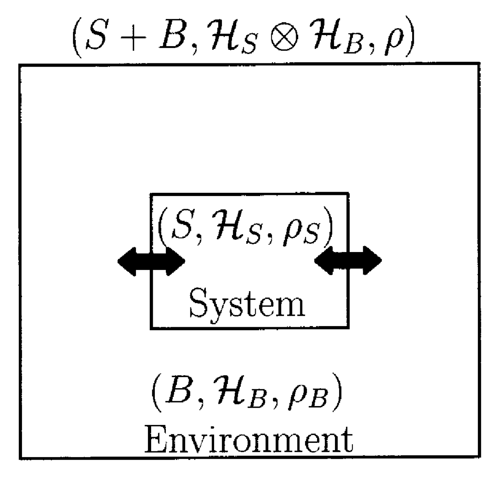

#  开放系统的 Lindblad 方程

量子力学的框架下，任意初态的演化由可由哈密顿量给出的幺正演化完全确定。只要我们假设所研究的系统是完全封闭的，量子系统的动力学演化问题原则上完全可知。然而对于实际的物理体系，总存在与外界的耦合。这时，我们原则上可以给出一个描述环境的模型，并假设系统-环境是整体构成由哈密顿量

$$
H_T = H + H_B + V
$$

描述，从而在量子力学框架下计算系统演化，最后对环境自由度部分取迹，得到系统演化后的状态。

不过由于环境往往具有很大的自由度，这样的直接计算往往是不现实的。我们因此希望寻找一个新的方程来描述系统演化。系统-环境耦合的作用能(近似地)体现在该方程中。描述一般的开放系统演化的方程被称为主方程(master equation)，而其中最简单的一种主方程叫做 Lindblad 方程：

$$
\frac{d\rho}{dt}= -i[H,\rho]+\sum_k \left(2L_k \rho L_k^\dagger-\{L_k^\dagger L_k, \rho\}\right).
$$

Lindblad 方程可以看成是系统-环境耦合在最低阶微扰和马尔可夫近似下的自然结果。同时，在量子信息的语言下，它可以看作是一个连续的、满足马尔可夫过程的 quantum channel. 最低阶微扰和马尔可夫近似也使得由 Lindblad 方程描述的动力学过程相对较易求解。

下文中，我们首先给出 Lindblad 方程的第一性导出。再介绍在 quantum channel 意义下，Lindblad 方程的普适性。

## 开放系统中的系统-环境耦合

考虑最一般的系统-环境哈密顿量：

$$
H_T = H + H_B + \sum_k A_k \otimes B_k.
$$

其中 $H$ 与 $H_B$ 分别为系统和环境的哈密顿量，$V$ 则代表耦合。我们假设初始状态，系统-环境为直积态：

$$
\rho_T(0) = \rho(0) \otimes \rho_B
$$

不失一般性，我们假设 $A_k$ 范数为 $1$，$B_k$ 对于环境的期望值为 $0$:

$$
\Vert A_k \Vert = 1,\ \mathrm{Tr}[B_k\rho_B] = 0.
$$

这样的分离总是可以做到的：若 $c=\mathrm{Tr}[B_k\rho_B] \ne 0$，我们可以令：

$$
B'_k=B_k-c,\ H'=H+cA_k.
$$

下面的推导中，我们考虑相互作用表象。此时密度矩阵的演化为：

$$
\frac{d}{dt} \rho_T(t) = -i[V, \rho_T(t)] 
:= -i\mathcal V |\rho_T(t)\rangle.
$$

由于现在我们考虑的对象是密度算符而非态，我们可以使用超算符记号简化表达式，即将对密度算符的线性操作记做左乘一个超算符(用花体字母表示)。上式与 $V$ 求对易子的操作被记为 $\mathcal V$, 而对总密度算富求部分迹(partial trace)可记为：

$$
|\rho\rangle = \langle \mathbb I_B|\rho_T\rangle
$$

因此，系统的演化方程为：

$$
\begin{eqnarray}
\frac{d}{dt} |\rho(t)\rangle &=& \langle \mathbb I_B|\frac{d}{dt} |\rho_T(t)\rangle \\
&=& -i \langle \mathbb I_B|\mathcal{V}(t) |\rho_T(0)\rangle - \int_0^t \langle \mathbb I_B| \mathcal{V}(t) \mathcal{V}(\tau) |\rho_T(\tau)\rangle d\tau \\
&=& - \int_0^t \langle \mathbb I_B| \mathcal{V}(t) \mathcal{V}(\tau) |\rho_T(\tau)\rangle d\tau.
\end{eqnarray}
$$

回到一般的算符表象下：

$$
\begin{eqnarray}
\frac{d}{dt} \rho(t) &=& 
-\mathrm{Tr}_B \int_0^t [V(t) ,[V(\tau), \rho_T(\tau)]] d\tau \\
&=&
\int_0^t \mathrm{Tr}_B\left[ V(t) \rho_T(\tau) V(\tau)- \rho_T(\tau) V(\tau) V(t) \right]d\tau +h.c.
\end{eqnarray}
$$

## Born-Markovian 近似

现在我们对上述第一性得到的演化方程做近似。假设环境相比系统足够大，耦合强度足够小，此时系统对环境的影响(在最低阶微扰意义下)可忽略，我们因此将总密度矩阵近似写为直积形式(Born 近似)：

$$
\rho_T(t) \approx \rho(t) \otimes \rho_B
$$

密度矩阵的近似分离性可以大大化简原来的方程：

$$
\begin{eqnarray}
\frac{d}{dt} \rho(t)
&=&
\int_0^t \mathrm{Tr}_B\left[ V(t) \rho_T(\tau) V(\tau)- \rho_T(\tau) V(\tau) V(t) \right]d\tau +h.c. \\
&=& 
\sum_{kl}\int_0^t d\tau\ C_{lk}(\tau - t) \left[A_k(t)\rho(\tau)A_l(\tau)-\rho(\tau)A_l(\tau)A_k(t)\right]+h.c.,
\end{eqnarray}
$$

其中

$$
C_{kl}(t) := \mathrm{Tr}_B[\rho_B B_k(t) B_l ]
$$

是环境算符 $\{B_k\}$ 之间的关联函数，满足：

$$
C_{kl}(t) = \mathrm{Tr}_B[B_lB_k(t)\rho_B]^* = C_{lk}^*(-t).
$$

此时，系统的演化方程含有从 $0$ 到 $t$ 时刻的积分，即系统的演化不但由该时刻的状态确定，还和其演化的历史有关。物理上，这是由于系统的在过去时刻对环境的扰动会在后续反作用于系统自身，这种延迟作用体现在环境关联函数 $C_{kl}(t)$ 上。这种推迟的影响给求解动力学带来了很大的困难。后续的近似的主要目的就是去掉这种历史依赖性。使得演化方程完全由体系在该时刻的状态决定。

一般而言，当环境的自由度足够大时，环境的时间关联衰减地极快，在此情况下，我们可以将积分中密度矩阵的参数 $\tau$ 替换为 $t$，同时令 $t'=t-\tau$，得到(Markovian 近似)：

$$
\frac{d}{dt} \rho(t) = 
\sum_{kl}\int_{0}^{t}dt' C_{lk}(-t') \left[A_k(t)\rho(t)A_l(t-t')-\rho(t)A_l(t-t')A_k(t)\right]+h.c.
$$

可以证明，Born-Markovian 近似的误差上限为：

$$
\Vert \varepsilon_{BM} \Vert=O(\tau_B/\tau_{SB}^2).
$$

其中两个时间尺度为：

$$
\begin{eqnarray}
\frac{1}{\tau_{SB}} &=& \max\int_0^\infty |C_{kl}(t)|dt, \\
\tau_B &=& \max \frac{\int_0^\infty t|C_{kl}(t)|dt}{\int_0^\infty |C_{kl}(t)|dt}.
\end{eqnarray}
$$

## 旋转波近似

经过 Born-Markovian 近似，我们去掉了演化方程中对过去时刻状态的显式依赖，然而运动方程仍然含有 $0$ 到 $t$ 的积分。为化简该式，令 $t\rightarrow\infty$，这在关联函数 $C_{kl}(t)$ 快速趋于 $0$ 的情况下是被允许的，此时：

$$
\frac{d}{dt} \rho(t) = 
\sum_{kl}\int_{0}^{\infty}dt' C_{lk}(-t') \left[A_k(t)\rho(t)A_l(t-t')-\rho(t)A_l(t-t')A_k(t)\right]+h.c.
$$

为使方程更紧凑，定义

$$
A_{k,f} := \sum_l \int_0^{\infty} dt' A_l(-t')C_{lk}(-t'),
$$

并将上述表达式变回薛定谔表象，得到称为 Redfild 主方程的动力学方程：

$$
\frac{d}{dt} \rho
= -i[H,\rho]+
\sum_{k} \left[A_k \rho A_{l,f}-\rho A_{k,f} A_k(t)+h.c.\right].
$$

尽管 Redfild 主方程在大多数情况下给出一个合理的运动方程，然而其存在一个明显的不足：演化后的态通常迹不为 $1$，这在长时间演化后会导致严重的误差。接下来，我们引入一个额外的近似将方程化为保迹的演化。首先在频率空间定义：

$$
A_k(t) = \sum_\omega A_{k,\omega} e^{-i\omega t}
$$

注意到 $A_k$ 的厄米性保证了：

$$
A_{k}(t)=A_k^\dagger(t) \Longleftrightarrow
A_{k,\omega} = A_{k,-\omega}^\dagger.
$$

从 Redfield 主方程出发(相互作用表象):

$$
\begin{eqnarray}
\frac{d}{dt} \rho(t)
&=& 
\sum_{kl}\sum_{\omega\omega'}\int_0^\infty dt' C_{lk}(-t')e^{-i(\omega +\omega')t+i\omega' t'} \left[A_{k,\omega}\rho A_{l,\omega'}-\rho A_{l,\omega'} A_{k,\omega}\right]+h.c.
\end{eqnarray}
$$

假设上述求和式中那些 $\omega+\omega'\ne 0$ 的快速“旋转波”部分贡献可以忽略(旋转波近似)，此时得到：

$$
\begin{eqnarray}
\frac{d}{dt} \rho(t)
&=&
\sum_{kl}\sum_{\omega}\int_{0}^{\infty} dt' \ C_{lk}(-t')e^{-i\omega t'} \left[A_{k,\omega}\rho A_{l,\omega}^\dagger-\rho A_{l,\omega}^\dagger A_{k,\omega}\right]+ \\
&& \sum_{kl}\sum_{\omega}\int_{0}^{\infty} dt' \ C_{lk}^*(-t')e^{+i\omega t'} \left[A_{l,\omega}\rho A_{k,\omega}^\dagger-A_{k,\omega}^\dagger A_{l,\omega}\rho\right].
\end{eqnarray}
$$

定义谱函数：

$$
\begin{eqnarray}
\Gamma_{kl}(\omega) &=& \int_0^\infty e^{i\omega t} C_{kl}(t)dt \\
&=& \frac{1}{2}\gamma_{kl}(\omega)+iS_{kl}(\omega),
\end{eqnarray}
$$

其中

$$
\gamma_{kl}(\omega) = \gamma_{lk}^*(\omega),\ 
S_{kl}(\omega) = S_{lk}^*(\omega).
$$

注意到

$$
\begin{eqnarray}
\gamma_{kl}(\omega) &=& \Gamma_{kl}(\omega) +\Gamma^*_{lk}(\omega)
=\int_{-\infty}^{+\infty}e^{i\omega t} C_{kl}(t)dt, \\
S_{kl}(\omega) &=& \frac{\Gamma_{kl}(\omega) - \Gamma^*_{lk}(\omega)}{2i}
=\int_{-\infty}^{+\infty} \frac{\mathrm{sign}(t)}{2i} e^{i\omega t} C_{kl}(t)dt.
\end{eqnarray}
$$

因此

$$
\begin{eqnarray}
\frac{d}{dt} \rho(t)
&=&
\sum_{kl}\sum_{\omega}
\gamma_{kl}(\omega)(A_{l,\omega}\rho A_{k,\omega}^\dagger-\frac{1}{2}\{\rho,A_{k,\omega}^\dagger A_{l,\omega}\}) \\
&&-i\left[\sum_{kl}\sum_{\omega}S_{kl}(\omega)\rho,A_{k,\omega}^\dagger A_{l,\omega},\rho\right].
\end{eqnarray}
$$

回到薛定谔表象：

$$
\begin{eqnarray}
\frac{d}{dt} \rho(t)
=-i[H+H_{LS},\rho]+
\sum_{kl}\sum_{\omega}
\gamma_{kl}(\omega)(A_{l,\omega}\rho A_{k,\omega}^\dagger-\frac{1}{2}\{\rho,A_{k,\omega}^\dagger A_{l,\omega}\}),
\end{eqnarray}
$$

其中 Lamb 移位为：

$$
H_{LS}=\sum_{kl}\sum_{\omega}S_{kl}(\omega)\rho,A_{k,\omega}^\dagger A_{l,\omega}.
$$

## 粗粒化主方程

上述推导中用到的旋转波近似是一个较强的假设，往往只对少体体系成立。而 Lindblad 方程的普适性较旋转波近似更强。当旋转波近似失效时，系统实际的演化可能有一个频率较高的振荡。如果我们忽略这种高频动力学，而考虑一个时间窗口内“抹匀”了的密度算符

$$
\bar\rho(t) = \frac{1}{T_a}\int_{t-T_a/2}^{t+T_a/2} dt' \rho(t'),
$$

就可以定义一个时间粗粒化的主方程，该方程在不引入旋转波近似的情况下就有 Lindblad 方程的形式。我们先回到 Born-Markovian 近似后的结果，代入粗粒化密度算符的定义式：

$$
\begin{eqnarray}
\frac{d}{dt} \rho(t)
&=& 
\sum_{kl}\sum_{\omega\omega'}\frac{1}{T_a}\int_{t-T_a/2}^{t+T_a/2} dt' \int_0^{t'} d\tau C_{lk}(-\tau)e^{-i(\omega +\omega')t'+i\omega' \tau} \left[A_{k,\omega}\rho(t) A_{l,\omega'}-\rho(t) A_{l,\omega'} A_{k,\omega}\right]+h.c.
\end{eqnarray}
$$

变换参数为 $\tau \rightarrow t'-\tau$，得到：

$$
\begin{eqnarray}
\frac{d}{dt} \rho(t)&=& 
\sum_{kl}\sum_{\omega\omega'}\frac{1}{T_a}\int_{t-T_a/2}^{t+T_a/2} dt' \int_0^{t'} d\tau C_{lk}(\tau-t')e^{-i\omega t'-i\omega' \tau} \left[A_{k,\omega}\rho(t) A_{l,\omega'}-\rho(t) A_{l,\omega'} A_{k,\omega}\right]+h.c.
\end{eqnarray}
$$

回到薛定谔表象：

$$
\begin{eqnarray}
\frac{d}{dt} \rho(t)&=& -i[H,\rho(t)]+
\sum_{kl}\sum_{\omega\omega'}\frac{1}{T_a}\int_{t-T_a/2}^{t+T_a/2} dt' \int_0^{t'} d\tau \times \\
&&
C_{lk}(\tau-t')e^{-i\omega (t'-t)-i\omega' (\tau-t)} \left[A_{k,\omega}\rho(t) A_{l,\omega'}-\rho(t) A_{l,\omega'} A_{k,\omega}\right]+h.c.
\end{eqnarray}
$$

变换参数 $t' \rightarrow t'-t,\ \tau\rightarrow \tau-t$，并考虑系数

$$
\sum_{kl}\sum_{\omega\omega'}\frac{1}{T_a}\int_{-T_a/2}^{T_a/2} dt' \int_{-t}^{t'} d\tau C_{lk}(\tau-t')e^{-i\omega t'-i\omega' \tau}.
$$

由于关联函数的快速衰减特性，可以丢掉积分域 $\tau\in[-t,-T_a/2)$，定义

$$
x^{lk}_{\omega\omega'} = \frac{1}{T_a}\int_{-T_a/2}^{T_a/2} dt' \int_{-T_a/2}^{t'} d\tau C_{lk}(\tau-t')e^{-i\omega t'-i\omega' \tau}
$$

利用关联函数的性质 $C_{kl}(t) = C_{lk}^*(-t)$， 有：

$$
x_{\omega\omega'}^{kl*} = \frac{1}{T_a}\int_{-T_a/2}^{T_a/2} dt' \int_{t'}^{T_a/2} d\tau C_{lk}(\tau-t')e^{-i\omega t'-i\omega' \tau},
$$

同时，利用 $t',\tau$ 的交换性($t'\rightarrow-\tau, \tau\rightarrow t'$)，有：

$$
x^{lk}_{\omega\omega'} = x^{lk}_{-\omega'-\omega}.
$$

可以定义

$$
\gamma_{\omega\omega'}^{kl} = x^{kl}_{\omega\omega'} + x^{lk*}_{\omega\omega'}
= \frac{1}{T_a}\int_{-T_a/2}^{T_a/2} dt' \int_{-T_a/2}^{T_a/2} d\tau C_{kl}(\tau-t')e^{-i\omega t'-i\omega' \tau}
$$

我们不借助旋转波近似，将演化方程化简为 Lindblad 方程的形式：

$$
\begin{eqnarray}
\frac{d}{dt} \rho(t)&=& -i[H,\rho(t)]+
\sum_{kl}\sum_{\omega\omega'}x^{lk}_{\omega\omega'}\left[A_{k,\omega}\rho(t) A_{l,\omega'}-\rho(t) A_{l,\omega'} A_{k,\omega}\right]+h.c. \\
&=& -i[H+H_{LS},\rho(t)]+
\sum_{kl}\sum_{\omega\omega'}\gamma^{kl}_{\omega\omega'} \left[A_{l,\omega}\rho A_{k,\omega'}-\frac{1}{2}\{\rho,A_{k,\omega'}A_{l,\omega}\}\right].
\end{eqnarray}
$$

其中 Lamb 移位为：

$$
\begin{eqnarray}
H_{LS} &=& -\sum_{kl}\sum_{\omega\omega'}\mathrm{Im}(x^{kl}_{\omega\omega'})A_{k,\omega'}A_{l,\omega} \\
&=& \frac{i}{2T_a}\int_{-T_a/2}^{T_a/2} dt' \int_{-T_a/2}^{T_a/2} \mathrm{sign}(t'-\tau)
d\tau C_{kl}(\tau-t')e^{-i\omega t'-i\omega' \tau}.
\end{eqnarray}
$$

## Lindblad 方程与 quantum channel

现在回过头考虑最一般的量子力学演化过程。同样假设初始时刻系统和环境可分：

$$
\rho_T=\rho\otimes\rho_B,\ \rho_B=\sum_\alpha \lambda_\alpha |\phi_\alpha\rangle\langle\phi_\alpha |.
$$

系统-环境整体演化形式上由一个幺正变化描述

$$
\rho_T(t) = U(t)\rho_TU^\dagger(t)
$$

对环境部分取迹，得到：

$$
\rho(t) = \sum_{\alpha\beta} W_{\alpha\beta} \rho W^\dagger_{\alpha\beta},
$$

其中

$$
W_{\alpha\beta} = \sqrt{\lambda_\beta} \langle\phi_\alpha|U(t)|\phi_\beta\rangle.
$$

一般地，形如

$$
\mathcal{L}[\rho] = \sum_\alpha K_\alpha \rho K_\alpha^\dagger
$$

的操作称为 quantum channel，它描述了有外界干扰下量子态变化的一般形式。

对于开放系统的演化，我们总可以形式上将其记为：

$$
\rho(t) = \mathcal{L}_t[\rho].
$$

而 Lindblad 方程假设这个烟花过程可以拆分为无穷小时间演化的迭代，即：

$$
\mathcal{L}_t = \lim_{N \rightarrow \infty} \mathcal{L}_{t/N}\cdot\mathcal{L}_{t/N}\cdots \mathcal{L}_{t/N}.
$$

这样的拆分隐含着每一时刻系统演与时间无关，仅与系统状态有关，这实际上是一种马尔可夫近似。我们将要说明，满足上述关系的演化方程形式上必然是 Lindblad 方程。

我们首先在希尔伯特空间内(设其为 $N$ 维)取一组正交完备算符基 $\{F_i\}$，满足：

$$
Tr[F_i^\dagger F_j] = \delta_{ij},
$$

其中，我们令 $F_0=N^{-1/2} \cdot\mathbb I$. 对于一个 quantum channel，算符 $K_\alpha$ 总能用此算符基展开。这样，我们有一般形式：

$$
\mathcal{L}_t[\rho] = \sum_{ij}c_{ij}(t)F_i\rho F_j^\dagger,
$$

其中

$$
c_{ij}(t) = \sum_{\alpha} Tr[F_i^\dagger K_\alpha]\cdot Tr[F_j^\dagger K_\alpha]^*.
$$

我们的目标是求出极限

$$
\frac{d}{dt} \rho := \lim_{t\rightarrow 0} \frac{1}{t}(\mathcal{L}_t[\rho]-\rho).
$$

为此，定义系数 $a_{ij}$:

$$
\begin{eqnarray}
	a_{00} &=& \lim_{t\rightarrow 0} \frac{c_{00}(t)-N}{t}, \\
	a_{ij} &=& \lim_{t\rightarrow 0} \frac{c_{ij}(t)}{t}.
\end{eqnarray}
$$

定义：

$$
\begin{eqnarray}
	F &=& \frac{1}{\sqrt N} \sum_{i=1}^{N^2-1} a_{i0} F_i, \\
	G &=& \frac{1}{2N}a_{00}\mathbb I +\frac{1}{2}(F^\dagger+F), \\
	H &=& \frac{1}{2i}(F^\dagger-F).
\end{eqnarray}
$$

上述极限可化简为：

$$
\frac{d\rho}{dt} = -i[H,\rho]+\{G, \rho\}+\sum_{i,j=1}^{N^2-1}a_{ij}F_i\rho F_j^\dagger.
$$

由于 quantum channel 总是保迹的，有关系：

$$
Tr\left[\frac{d\rho}{dt}\right]= Tr\left[ \left(2G+\sum_{i,j=1}^{N^2-1}a_{ij}F_j^\dagger F_i \right)\rho \right]=0
$$

因此有

$$
G = -\frac{1}{2}\sum_{i,j=1}^{N^2-1}a_{ij}F_j^\dagger F_i.
$$

因此得到 Lindblad 形式：

$$
\frac{d\rho}{dt} = -i[H,\rho]+\sum_{i,j=1}^{N^2-1}a_{ij} \left(F_i\rho F_j^\dagger-\frac{1}{2}\{F_j^\dagger F_i, \rho\} \right).
$$

## References

1. H.P. Breuer & F. Petruccione, *The Theory of Open Quantum System*.
2. E. Mozgunov & D. Lidar, *Completely positive master equation for arbitrary driving and small level spacing*.
3. F. Nathan and M. S. Rudner, *Universal Lindblad equation for open quantum systems*.
4. Preskill, *Lecture Notes on Quantum Computation*.
