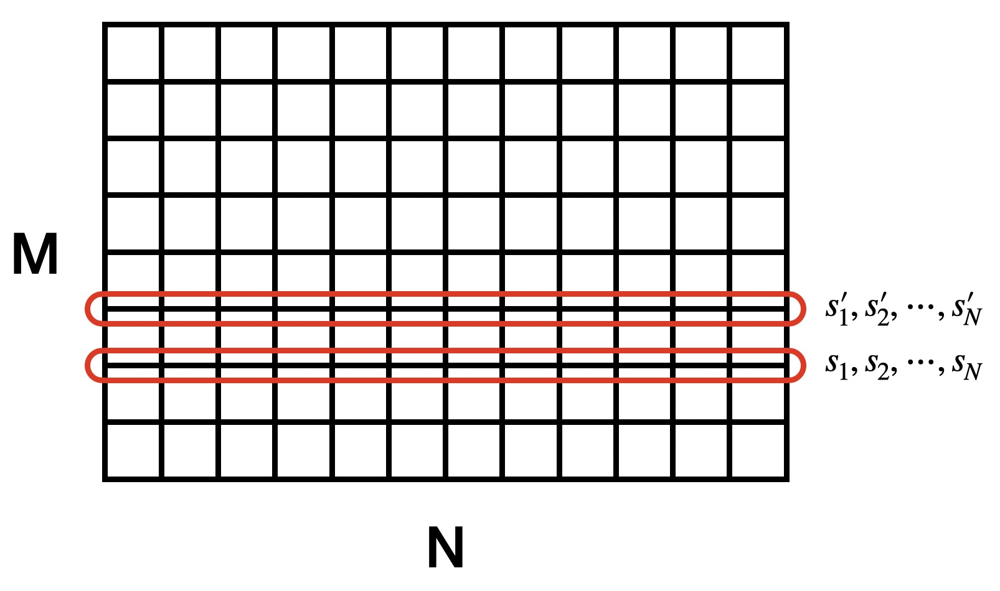
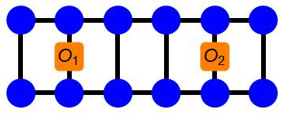

# 转移矩阵

转移矩阵最早是在处理经典伊辛模型中引入的，这是由于经典伊辛模型配分函数有连乘形式

$$
	Z = \mathrm{Tr}(T^N)
$$

其中 $T$ 是某个矩阵，满足上面这种矩阵乘积形式的 $T$ 称为转移矩阵。对于有上式这种形式的配分函数，我们只要计算出转移矩阵的本征值，就可以确定系统许多统计性质。这往往能大大化简问题。

本文将以一维和二维经典伊辛模型为例子。首先介绍经典伊辛模型中转移矩阵的引入，其本征谱与相变临界点关系。之后我们会讨论通过转移矩阵联系 $d$ 维经典有限温度系统与 $d - 1$ 维零温量子系统，并通过这种方法将二维经典伊辛模型转化为零温量子伊辛模型严格求解。最后，我们会讨论在零温量子体系内出现的转移矩阵。

## 一维经典伊辛模型

我们首先从最简单的一维经典伊辛模型入手。考虑一个 $N$ 格点周期边界系统：

$$
	H = -J\sum_{i}s_{i}s_{i+1},
$$

我们处理的是一个经典统计问题。考虑配分函数：

$$
	Z = \sum_{\{s_i\} }\prod_{i} e^{K s_{i} s_{i+1}},
$$

其中 $K=\beta J$. 注意到配分函数的求和可以写为一个连乘形式：

$$
	Z = \mathrm{Tr} \left(T^{N}\right),
$$

其中引入转移矩阵 $T$，其矩阵元为：

$$
	T_{ss'} \equiv e^{Kss'} =
	\left(
	\begin{array}{cc}
		e^{ K} & e^{-K} \\
		e^{-K} & e^{ K}
	\end{array}
	\right).
$$

现在我们说明，转移的本征谱可以给出系统的统计信息。为看出这点，我们首先给出转移矩阵的谱分解：

$$
	T=\lambda_{0}\left|0\right\rangle \left\langle 0\right|+\lambda_{1}\left|1\right\rangle \left\langle 1\right|,
$$

其中两本征值为：

$$
	\lambda_0 = 2\cosh K, \\
	\lambda_1 = 2\sinh K,
$$

相应的本征态为：

$$
	\left|0\right\rangle ,\left|1\right\rangle 
	=\frac{1}{\sqrt{2}}
	\left(
	\begin{array}{c}
		1\\
		\pm1
	\end{array}
	\right).
$$

### 配分函数

得到转移矩阵 $T$ 的谱之后(往往我们只会用到本征值)，我们可以直接计算配分函数：

$$
\begin{eqnarray}
	Z & = & \left\langle 0\right|T^{N}\left|0\right\rangle +\left\langle 1\right|T^{N}\left|1\right\rangle \nonumber \\
 	& = & \lambda_{0}^{N}+\lambda_{1}^{N}\nonumber \\
 	& = & \lambda_{0}^{N}\left[1+\left(\frac{\lambda_{1}}{\lambda_{0}}\right)^{N}\right]\nonumber \\
 	& = & \left(2\cosh K\right)^{N}\left[1+\tanh^{N}K\right].
\end{eqnarray}
$$

从配分函数的形式中，我们看到当我们取热力学极限：$N\rightarrow\infty$ 时， $Z\rightarrow\left(2\cosh K\right)^{N}$，热力学极限下的平均自由能

$$
	f \equiv -\lim_{N\rightarrow\infty}\frac{1}{N}\ln Z=-2\ln\lambda_{0}
$$

完全来自于转移矩阵的基态。当我们改变温度，若转移矩阵的本征值发生交叉，体系自由能在交叉处就会有非解析性，该临界点就发生了热力学相变。转移矩阵谱的简并意味着相变临界点，对于我们现在讨论的模型，有限温度时总是有 $\lambda_{0}>\lambda_{1}$，即一维经典伊辛模型只有一个相。

### 关联函数
现在我们的讨论伊辛模型的关联函数。考虑格点算符 $O_{i}$ 关联函数(设 $i<j$)：

$$
\begin{eqnarray}
	\langle O_i O_j \rangle  
	& = & \frac{\mathrm{Tr} [e^{-\beta H} O_i O_j]}{\mathrm{Tr}[e^{-\beta H}]} \nonumber \\
 	& = & \frac{\mathrm{Tr} [T^{N}O_i O_j ]}{\mathrm{Tr}[T^{N}]}\nonumber \\
 	& = & \frac{\mathrm{Tr}[T^{i}O_i T^{j-i}O_j T^{N-j}]}{\mathrm{Tr}[T^{N}]}.
\end{eqnarray}
$$

此形式类似时序格林函数。实际上，以转移矩阵作为桥梁，我们可以将一个 $d$ 维有限温经典配分函数转换为一个 $d - 1$ 维零温量子系统哈密顿量，我们将在后文讨论这点。这里，我们写出分子的低阶表达式：

$$
	\mathrm{Tr} [T^{i}O_{i}T^{j-i}O_{j}T^{N-j}]
	\approx \lambda_0^N \left[\left\langle 0\right|O_{i}\left|0\right\rangle \left\langle 0\right|O_{j}\left|0\right\rangle +\left(\frac{\lambda_{1}}{\lambda_{0}}\right)^{j-i}\left\langle 0\right|O_{i}\left|1\right\rangle \left\langle 1\right|O_{j}\left|0\right\rangle \right].
$$

两点关联函数为：

$$
\begin{eqnarray}
\left\langle O_{i}O_{j}\right\rangle _{c} & = & \left\langle O_{i}O_{j}\right\rangle -\left\langle O_{i}\right\rangle \left\langle O_{j}\right\rangle \nonumber \\
 & = & \left(\frac{\lambda_{1}}{\lambda_{0}}\right)^{j-i}\left\langle 0\right|O_{i}\left|1\right\rangle \left\langle 1\right|O_{j}\left|0\right\rangle .
\end{eqnarray}
$$

注意上式表明转移矩阵最大本征值非简并(或者称转移矩阵的谱有“能隙”)意味着关联函数指数衰减，衰减的特征长度(关联长度)为 $\xi = \lambda_{1}/\lambda_{0}$. 这从另一个角度说明转移矩阵和相变临界点的联系，我们知道相变临界点的一个特征是关联长度发散，对应到转移矩阵上就是转移矩阵的最大本征值出现简并(转移矩阵的谱“能隙关闭”)。对于一维经典伊辛模型，取 $O_{i}=s_{i}$，关联函数为：

$$
	\left\langle s_{i}s_{j}\right\rangle_c
	= \xi^{|i-j|}
	= \left(\tanh K\right)^{\left|i-j\right|}.
$$

即关联长度 $\xi = \tanh (\beta J)$，注意到有限温下一位经典伊辛模型关联长度总是有限的，因此不存在顺磁-铁磁相变。

## 转移矩阵联系经典与量子系统

我们在这部分讨论伊辛模型上的有限温经典配分函数到零温量子哈密顿量的联系。其基本思想是将配分函数分割成 $N$ 个转移矩阵的乘积，这 $N$ 个乘积对应了统计系统的一个维度。转移矩阵本身会对应少一个维度的体系。这个体系往往会出现一些非对易的算符，因此是一个量子体系。我们会在接下来的例子中具体说明：

- 一维经典伊辛模型配分函数对应零维量子自旋模型哈密顿量；
- 二维经典伊辛模型配分函数对应一维量子伊辛模型哈密顿量。

### 一维经典伊辛对应零维量子自旋体系

以下讨论中，我们会在伊辛模型中加入一个形式为

$$
	-h\sum_{i}s_{i}
$$

的外磁场项。一维带外场的经典伊辛模型配分函数为：

$$
	Z=\sum_{\left\{ s_{i}\right\} }\prod_{i} \exp\left(Ks_{i}s_{i+1}+H \frac{s_{i}+s_{i+1}}{2}\right),
$$

其中 $K=\beta J,H=\beta h$. 利用类似的方法，定义：

$$
\begin{eqnarray}
	V_{ss'}^{(1)} &=& \exp(Kss') \propto \exp(K^{*}\sigma^{x}_{ss'}), \\
	V_{ss'}^{(2)} &=& \exp\left(H\frac{s_i+s_{i+1}}{2}\right) = \exp(H\sigma^z_{ss'}).
\end{eqnarray}
$$

其中 $\tanh K^{*}=e^{-2K}$，此时配分函数可以写为

$$
\begin{eqnarray}
	Z &=& \sum_{\{s_i\}}\prod_i V^{(1)}_{s_{i}s_{i+1}} V^{(2)}_{s_{i}s_{i+1}} \\
	&=& \sum_{\{s_i\}}\prod_i \exp(K^* \sigma^x_{s_{i}s_{i+1}}+H\sigma^z_{s_{i}s_{i+1}})
\end{eqnarray}
$$

转移矩阵现在可以写为：

$$
	\hat T = \exp(K^* \hat\sigma^x + H \hat\sigma^z),
$$

转移矩阵对应一个量子自旋系统，其哈密顿量为：

$$
	\hat{H}=-K^* \hat\sigma^{x}-H \hat\sigma^{z}.
$$

回忆我们之前的结论，经典统计的问题可以转化为求转移矩阵的本征值问题。而转移矩阵的本征值问题和我们在上面定义的这个哈密顿量的本征值问题是等价的。同时注意无论 $J,h,\beta$ 如何取值，上式对应的总是一个平庸的与外场耦合的自旋哈密顿量，这从另一个角度作证了一维伊辛模型只有一个相。

### 二维经典伊辛对应一维量子伊辛

一维模型作为例子足够说明转移矩阵的性质。但一维经典体系没有相变，更加非平庸的结论存在于二维体系中。考虑二维经典伊辛模型($N\times M$)：

$$
	H=-J_{\tau}\sum_{i,j}s_{i,j}s_{i,j+1}-J_{x}\sum_{i,j}s_{i,j}s_{i+1,j}.
$$

配分函数为：

$$
	Z=\sum_{\left\{ s_{i,j}\right\} }\prod_{i,j} \exp\left(K_{\tau}s_{i,j}s_{i,j+1} + K_{x}s_{i,j}s_{i+1,j}\right).
$$

其中 $K_\tau = \beta J_\tau, K_x = \beta J_x$. 配分函数和一维情形基本一致，只是扩展了一个维度。这时，我们定义

$$
\begin{eqnarray}
	V^{(1)}_{s_1,\cdots,s_N;s'_1,\cdots,s'_N} 
	&=& \prod_{i}\exp(K_{\tau}s_{i}s'_{i}), \\
	V^{(2)}_{s_1,\cdots,s_N;s'_1,\cdots,s'_N}
	&=&  \prod_i \exp\left(K_{x} s_i s_{i+1}+s'_is'_{i+1}\right).
\end{eqnarray}
$$

此时 $(s_1,\cdots,s_N)$ 对应了一个维度上经典自旋取值的“截面”，我们这里沿着 $\tau$ 方向将自旋分为 $M$ 层。

这样，配分函数写为：

$$
	Z = \sum_{\{s_{i,j}\}}\prod_{j} \left(V^{(1)} V^{(2)}\right)_{s_{1,j+1},\cdots,s_{N,j+1};s_{1,j},\cdots,s_{N,j}}
$$

此时转移矩阵 $T$ 实际上是个张量，拥有指标数为 $2N$，但其定义式和一维情况类似：

$$
	T_{s_1,\cdots,s_N;s'_1,\cdots,s'_N} = 
	V^{(1)}_{s_1,\cdots,s_N;s'_1,\cdots,s'_N}
	V^{(2)}_{s_1,\cdots,s_N;s'_1,\cdots,s'_N},
$$

我们现在将 $V^{(1)},V^{(2)}$ 写为算符形式，对 $V^{(1)}$：

$$
	V^{(1)}_{s_1,\cdots,s_N;s'_1,\cdots,s'_N} = \prod_i \exp(K^*_\tau \sigma^x_{s_is'_i})
$$

对于 $V^{(2)}$，注意到

$$
	\sum_{\{s_i\},\{s'_i\}}s_is_{i+1}+s'_i s'_{i+1} =  \frac{1}{2}(s_i+s'_i)(s_{i+1}+s'_{i+1}),
$$

因此 $V^{(2)}$ 可化简为：

$$
\begin{eqnarray}
	V^{(2)}_{s_1,\cdots,s_N;s'_1,\cdots,s'_N} &=&  \exp\left[\frac{K_{x}}{2}\sum_{i}(s_is_{i+1}+s'_i s'_{i+1})\right] \\
	&\simeq& \exp\left[K_{x}\sum_{i}\frac{s_i+s'_i}{2}\frac{s_{i+1}+s'_{i+1}}{2}\right] \\
	&=& \prod_{i}\exp\left(K_x \sigma^z_{s_is'_i}\sigma^z_{s_{i+1}s'_{i+1}}\right).
\end{eqnarray}
$$

因此和一维情形一样，转移矩阵(张量)最终对应到一个一维量子哈密顿量：

$$
	\hat{H}=-K^*_\tau \sum_{i}\hat\sigma_{i}^{x}-K_x\sum_{i}\sigma_{i}^{z}\sigma_{j}^{z},
$$

这正是一维量子横场伊辛模型。该模型量子临界点在

$$
	K_{x} = K_{\tau}^{*}
$$

处。若取  $J_{x}=J_{\tau}$ :

$$
\begin{eqnarray}
	K = K^{*}\ \Longrightarrow \ e^{-2K} = \tanh K,
\end{eqnarray}
$$

我们由此得到二维伊辛模型临界温度：

$$
\frac{kT}{J}=\frac{2}{\ln\left(1+\sqrt{2}\right)}\approx2.269.
$$

## 矩阵乘积态中的转移矩阵

之前我们主要讨论了转移矩阵用于计算经典统计中的配分函数。在这部分我们讨论其在矩阵乘积态上的几个应用。

### 矩阵乘积态的内积

对于一矩阵乘积态(MPS)：

$$
	|\psi\rangle = \sum_{\{s_i\}} A^{[s_1]}A^{[s_2]}\cdots A^{[s_N]} |s_1,s_2,\cdots,s_N\rangle
$$

考虑两个MPS $|\psi\rangle, |\phi\rangle$ 的内积：

$$
	\langle\psi|\phi\rangle = \sum_{\{s_i\}} \left(A^{[s_1]}\cdots A^{[s_N]}\right)^* \left(B^{[s_1]}\cdots B^{[s_N]}\right)
$$

这个求和用张量的图形表示为：

从图形上我们容易发现，这个张量缩并过程有一个基本单元：

$$
	T^{[i]}_{i,j;k,l}\equiv \sum_{s_i} \left(A^{[s_i]}_{i,k}\right)^*B^{[s_i]}_{j,l},
$$

图形表示为：

 

平移不变 MPS 的内积可表示为：

$$
	\langle\psi|\phi\rangle = \mathrm{Tr}\left[ T^N \right].
$$

### 矩阵乘积态的关联函数

同样，考虑 MPS $|\psi\rangle$ 的关联函数：

$$
	\langle \hat{O}_i \hat{O}_{i+1} \rangle_c,
$$

其图形表示为：

和伊辛模型的情况基本相同，我们容易发现，对平移不变系统，转移矩阵最大本征值非简并意味着关联函数的指数衰减，且关联长度同样为 $\xi = \lambda_1/\lambda_0$.

## 一维安德森局域化

考虑一维无相互作用系统：

$$
	\hat{H} = -t\sum_i \hat{c}_i^\dagger \hat{c}_{i+1} + \sum_i \mu_i\hat{c}_i^\dagger \hat{c}_{i} +h.c.
$$

其中 $\mu_i \in [-V,V]$ 是随机无序化学势。安德森局域化表明，只要 $V>0$，该系统一定是局域化的，即虽有单粒子波函数在实空间中都指数局域。要说明这点，我们考虑单体波函数：

$$
	|\vec{a}\rangle = \sum_i a_i \hat{c}^\dagger_i |0\rangle.
$$

本征条件要求：

$$
	\hat{H}|\vec{a}\rangle = E|\vec{a}\rangle\,
$$

整理一下上式的系数发现：

$$
	a_{i+1} = \frac{\mu_i-E}{t} a_i-a_{i-1},
$$

我们可以将这个递推关系表示为矩阵形式：

$$
	\left(
	\begin{array}{c}
		a_{N+1} \\
		a_{N}
	\end{array}
	\right) = 
	\left(
	\begin{array}{cc}
		\frac{\mu_i-E}{t} & -1 \\
		1 & 0
	\end{array}
	\right)
	\left(
	\begin{array}{c}
		a_{N} \\
		a_{N-2}
	\end{array}
	\right)
	=\prod_{i=1}^{N} T_i 
	\left(
	\begin{array}{c}
		a_{1} \\
		a_{0}
	\end{array}
	\right),
$$

其中

$$
	T_i = \left(
	\begin{array}{cc}
		\frac{\mu_i-E}{t} & -1\\
		1 & 0
	\end{array}
	\right).
$$

此时，我们只需证明当 $N\rightarrow \infty$ 时转移矩阵乘积渐进形式是指数就证明了单体本征态波函数是局域的。不同的是这里我们处理的转移矩阵不是相同的，这给我们的处理带来了困难，然而我们可以利用一个数学定理(Furstenberg's theorem，见参考文献 [2] [3])，得到：

$$
	\lim_{n\rightarrow \infty}\log \Vert \prod_i^N T_i \Vert = \gamma>0.
$$

这里的系数 $\gamma^{-1}$ 就是局域波函数的关联长度。

## References

[1] Shankar, Quantum Field Theory and Condensed Matter.

[2] H. Furstenberg and H. Kesten, The Annals of Mathematical Statistics 31, 457 (1960). 

[3] K. Ishii, Progress of Theoretical Physics Supplement 53, 77 (1973).
