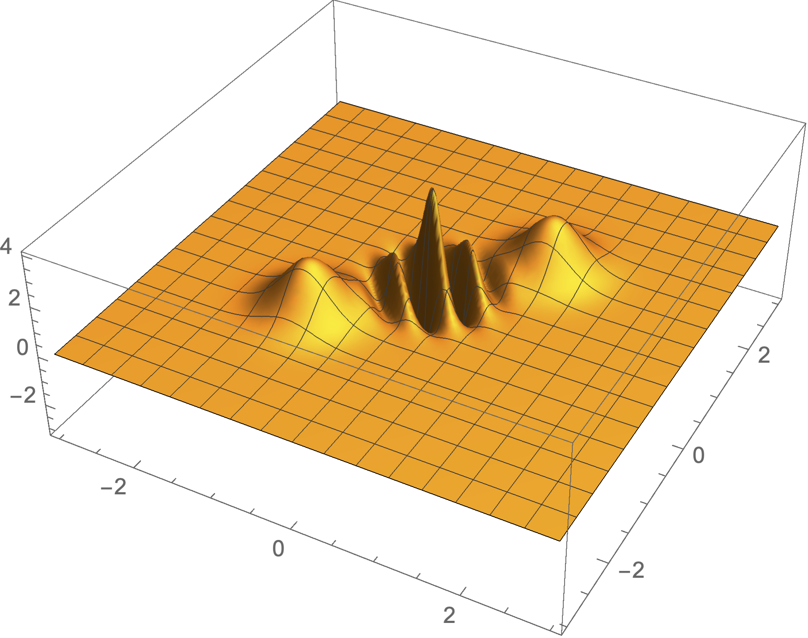
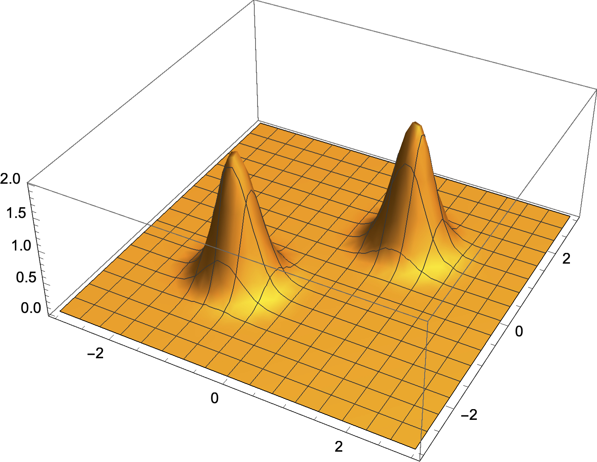

# 相空间中的量子力学

## Wigner-Weyl 变换
Wigner-Weyl 变化是一对互逆的积分变换，它可将在希尔伯特空间中的线形算符变换为相空间的分布函数(Wigner 变换)：

$$
	A_W(x,p) \equiv \int \left\langle x+\frac{y}{2}\right|\hat A(\hat x,\hat p) \left|x-\frac{y}{2}\right\rangle e^{-\frac{i}{\hbar}py} dy.
$$

或反过来，将相空间的分布函数变换为希尔伯特空间中的算符(Weyl 变换)：

$$
	\hat A(\hat x,\hat p) = \frac{1}{(2\pi \hbar)^2} \iiiint A_W(x,p) e^{\frac{i}{\hbar}[\xi(\hat x -x)+\eta(\hat p - p)]} d\xi d\eta dx dp.
$$

其中 $\hat A(\hat x,\hat p)$ 是定义在希尔伯特空间中的算符，$\hat A$ 可看作共轭算符 $\hat x, \hat p$ 的函数，而 $A_W(x,p)$ 是对应的相空间中的函数。

### 逆变换证明
我们首先说明这组变换确实是互逆的。为了更好地比较，我们取算符 $\hat A(\hat x,\hat p)$ 关于坐标基底的矩阵元：

$$
\begin{eqnarray}
	\langle u| \hat A(\hat x,\hat p) |v\rangle
	&=& \frac{1}{(2\pi \hbar)^2} \iiiint A'_W(x,p) \langle u| e^{\frac{i}{\hbar}[\xi(\hat x -x)+\eta(\hat p - p)]} |v\rangle d\xi d\eta dx dp \nonumber \\
	&=& \frac{1}{(2\pi \hbar)^2} \iiiint A'_W(x,p) e^{-\frac{i}{\hbar}(\xi x+\eta p)} \langle u| e^{\frac{i}{\hbar}(\xi \hat x +\eta \hat p)} |v\rangle d\xi d\eta dx dp.
\end{eqnarray}
$$

注意等式右边的积分式中只有指数部分 $\exp[\frac{i}{\hbar}(\xi \hat x +\eta \hat p)]$ 含有算符，我们只需考虑这部分矩阵元。利用 BCH 公式，我们将指数上的非对易算符分开：

$$
	e^{\frac{i}{\hbar}(\xi \hat x +\eta \hat p)}
	= e^{\frac{i}{\hbar}\xi \hat x} e^{\frac{i}{\hbar}\eta \hat p} e^{\frac{i}{\hbar}\frac{\xi\eta}{2}}.
$$

在薛定谔表象下，我们知道：

$$
\begin{eqnarray}
	e^{\frac{i}{\hbar} \xi \hat x} | a \rangle &=& e^{\frac{i}{\hbar} \xi a} |a \rangle, \\
	e^{\frac{i}{\hbar} \eta \hat p} | a \rangle &=& |a-\eta \rangle.
\end{eqnarray}
$$

因此坐标基底矩阵元为：

$$
	\langle u| e^{\frac{i}{\hbar}(\xi \hat x +\eta \hat p)} |v\rangle
	= e^{\frac{i}{\hbar} \left( \xi u + \frac{\xi \eta}{2}\right)} \delta(u-v+\eta).
$$

将此结果带回原式：

$$
\begin{eqnarray}
	\langle u| \hat A(\hat x,\hat p) |v\rangle
	&=& \frac{1}{(2\pi \hbar)^2} \iiiint A'_W(x,p) e^{-\frac{i}{\hbar}\left(\xi x+\eta p - \xi u + \frac{\xi \eta}{2} \right)} \delta(u-v+\eta) d\xi d\eta dx dp \nonumber \\
	&=& \frac{1}{(2\pi \hbar)^2} \iiint A'_W(x,p) e^{-\frac{i}{\hbar}\left[\xi \left(x-\frac{u+v}{2}\right)-p(u-v) \right]} d\xi dx dp \nonumber \\
	&=& \frac{1}{2\pi \hbar} \int A'_W\left(\frac{u+v}{2},p\right) e^{\frac{i}{\hbar}p(u-v)} dp
\end{eqnarray}
$$

现在令

$$
\begin{eqnarray}
	u &=& x+\frac{y}{2}, \\
	v &=& x-\frac{y}{2}.
\end{eqnarray}
$$

因此

$$
	\left\langle x+\frac{y}{2} \right| \hat A(\hat x,\hat p) \left| x-\frac{y}{2} \right\rangle = \frac{1}{2\pi \hbar} \int A'_W(x,p) e^{\frac{i}{\hbar}py} dp
$$

该式和 Wigner 变换构成一对互逆的傅立叶变换，我们因此说明了互逆性。

### 求迹公式
Wigner 变换一个重要的性质，是可以将两个算符乘积求迹运算，转化为相空间积分：

$$
	\mathrm{Tr}[\hat A \hat B]=\frac{1}{2\pi\hbar}\iint A_W(x,p)B_W(x,p)dxdp,
$$

其中 $A_W,B_W$ 分别为两个算符的 Wigner 变换。上式的证明是直接的：

$$
\begin{eqnarray}
	&& \frac{1}{2\pi\hbar}\iint A_W(x,p)B_W(x,p)dxdp \nonumber \\
	&=& \frac{1}{2\pi\hbar}\iiiint \left\langle x+\frac{y}{2}\right|\hat A(\hat x,\hat p) \left|x-\frac{y}{2}\right\rangle\left\langle x+\frac{z}{2}\right|\hat B(\hat x,\hat p) \left|x-\frac{z}{2}\right\rangle e^{-\frac{i}{\hbar}p(y+z)} dxdpdydz \nonumber \\
	&=& \iint \left\langle x+\frac{y}{2}\right|\hat A(\hat x,\hat p) \left|x-\frac{y}{2}\right\rangle\left\langle x-\frac{y}{2}\right|\hat B(\hat x,\hat p) \left|x+\frac{y}{2}\right\rangle dxdy \nonumber \\
	&=& \iint \langle u|\hat A(\hat x,\hat p) |v\rangle \langle v|\hat B(\hat x,\hat p) |u\rangle dudv \nonumber \\
	&=& \mathrm{Tr}[\hat A \hat B].
\end{eqnarray}
$$

## Weyl 量子化
通过 Wigner-Weyl 变换，我们可以将熟悉的定义在希尔伯特空间的量子力学在相空间构造出来，而后者在 $\hbar \rightarrow 0$ 极限下自然得到经典力学的结果。因此量子力学的想空间形式(Weyl 量子化)可以方便地做量子-经典对应。

### Wigner 函数
量子力学的观测量可用态的密度矩阵与观测量算符的乘积求迹得到：

$$
\begin{eqnarray}
	\langle \hat\Omega(\hat x,\hat p)\rangle = \mathrm{Tr}[\hat \rho \hat \Omega],
\end{eqnarray}
$$

我们因此定义 Wigner 函数为密度矩阵的 Wigner 变换：

$$
	W(x,p) \equiv \rho_W(x,p) = \int \psi\left(x+\frac{y}{2}\right) \psi^{*}\left(x-\frac{y}{2}\right)e^{-\frac{i}{\hbar}py}dy
$$

算符期望值为

$$
	\langle \hat \Omega\rangle = \frac{1}{2\pi \hbar} \iint W(x,p)\Omega_W(x,p) dxdp.
$$

即，当计算出态的 Wigner 函数后，我们只需计算任意算符的 Wigner 变换函数，将其与 Wigner 函数做积分就得到了算符期望，特别的，对于形式为 $\hat \Omega(\hat x,\hat p)=\hat \Omega_1(\hat x)+\hat \Omega(\hat p)$ 的算符，其 Wigner 变换为 $\Omega_W(x,p) = \Omega(x,p)$，因此对于量子力学中一般哈密顿量形式 $\hat H = \hat T(\hat p)+\hat U(\hat x)$，能量期望为：

$$
	\bar E = \langle \hat H\rangle = \frac{1}{2\pi \hbar} \iint W(x,p)H(x,p) dxdp.
$$

从形式上看，Wigner 函数似乎给出相空间的一种概率分布。注意到 Wigner 函数首先是归一化的。要说明这点，首先注意到密度矩阵求迹为 1:

$$
	\mathrm{Tr}[\hat \rho] = \frac{1}{2\pi \hbar}\iint dxdp W(x,p) \cdot 1_W = 1,
$$

而单位算符的 Wigner 变换为：

$$
\begin{eqnarray}
	1_W
	&=& \int \left\langle x+\frac{y}{2}\right| \hat 1 \left|x-\frac{y}{2} \right\rangle e^{-\frac{i}{\hbar}py} dy \nonumber \\
	&=& \int \delta(y) e^{-\frac{i}{\hbar}py} dy \nonumber \\	&=& 1.
\end{eqnarray}
$$

我们因此得到了 Wigner 函数的归一化关系。然而，Wigner 函数不能看作一组概率分布，原因是其不是恒正的。要说明这点，我们考虑两个正交波函数：

$$
	\langle \psi_1| \psi_2\rangle = 0\ \Longrightarrow
	\ \mathrm{Tr}\left[\rho_1\rho_2 \right] = \frac{1}{2\pi \hbar} \iint dxdp W_1(x,p)W_2(x,p)=0,
$$

其中 $\rho_i = |\psi_i\rangle\langle \psi_i|$. 上式意味着 $W_1(x,p),W_2(x,p)$ 两个函数不可能归一并恒正。实际上，Wigner 函数取负值正是系统“量子性”的体现。同时，Wigner 函数的绝对值是有上界的。为说明这点，我们将 Wigner 函数改写为：

$$
	W(x,p) = 2 \int \psi_1(y)\psi_2^{*}(y) dy,
$$

其中我们定义两个归一化波函数：

$$
\begin{eqnarray}
	\psi_1(y) &=& \frac{1}{\sqrt{2}}e^{-\frac{i}{2\hbar}py} \psi\left(x+\frac{y}{2}\right), \\
	\psi_2(y) &=& \frac{1}{\sqrt{2}}e^{+\frac{i}{2\hbar}py} \psi\left(x-\frac{y}{2}\right).
\end{eqnarray}
$$

对于两个归一化波函数，我们有 $|\langle\psi_1|\psi_2\rangle| \le 1$, 因此我们给出 Wigner 函数绝对值的上界：

$$
	|W(x,p)| \le 2.
$$

### 对易关系
“量子性”的体现之一在于算符对易关系，这也是经典和量子的重要区别。在 Weyl 量子化框架下，算符 $\hat A,\hat B$ 的对易关系转化为了对应函数 $A_W,B_W$ 的 Moyal 括号(后面定义)。而Moyal 括号的经典极限 $\hbar \rightarrow 0$ 就是泊松括号。因此 Weyl 量子化下量子和经典的过度是自然的。

下面我们首先考虑希尔伯特空间中算符 $\hat A,\hat B$ 乘积在坐标基底下的矩阵元：

$$
\begin{eqnarray}
	\langle x|\hat A \hat B|y\rangle
	= \int \langle x|\hat A|z\rangle \langle z| \hat B|y\rangle dz.
\end{eqnarray}
$$

利用公式：

$$
\begin{eqnarray}
	\langle u| \hat A(\hat x,\hat p) |v\rangle
	&=& \frac{1}{2\pi \hbar} \int A_W\left(\frac{u+v}{2},p\right) e^{\frac{i}{\hbar}p(u-v)} dp \nonumber \\
	&=& \int \tilde{A}_W(\alpha,v-u)e^{\frac{i}{\hbar}\frac{u+v}{2}\alpha} d\alpha
\end{eqnarray}
$$

其中 $\tilde A_W$ 是 $A_W$ 的傅立叶变换：

$$
	A_W(x,p) = \int \tilde A_W(\alpha,\beta) e^{\frac{i}{\hbar}(\alpha x+\beta p)}d\alpha d\beta
$$

因此

$$
\begin{eqnarray}
	(AB)_W(x,p) 
	&=& \int \left\langle x+\frac{y}{2}\right|\hat A \hat B \left|x-\frac{y}{2}\right\rangle e^{-\frac{i}{\hbar}py}dy \nonumber \\
	&=& \iint \langle x+\frac{y}{2}|\hat A |z\rangle \langle z| \hat B |x-\frac{y}{2}\rangle e^{-\frac{i}{\hbar}py} dz dy \nonumber \\
	&=& \iiiint \tilde{A}_W\left(\alpha,z-x-\frac{y}{2}\right) \tilde{B}_W\left(x-\frac{y}{2}-z\right) e^{\frac{i}{\hbar}\left(\alpha\frac{x+y/2+z}{2}+\beta\frac{x-y/2+z}{2}-py\right)} d\alpha d\beta dz dy
\end{eqnarray}
$$

做变量替换：

$$
\begin{eqnarray}
	\xi &=& z-x-\frac{y}{2}, \\
	\eta &=& x-\frac{y}{2}-z,
\end{eqnarray}
$$

上式化为

$$
\begin{eqnarray}
	(AB)_W(x,p) &=& \iiiint \left[\tilde A_W(\alpha,\xi) e^{\frac{i}{\hbar}(\alpha x+\xi p)}\right] e^{\frac{i}{2\hbar}(\xi \beta - \alpha \eta)}\left[ \tilde B_W(\beta,\eta)e^{\frac{i}{\hbar}(\beta x+\eta p)} \right] d\alpha d\beta d\xi d\eta \nonumber \\
	&=& A_W(x,p) \exp\left[\frac{i}{2\hbar}\left(\frac{\hbar}{i}\overleftarrow{\partial}_p \frac{\hbar}{i}\overrightarrow{\partial}_x - \frac{\hbar}{i}\overleftarrow{\partial}_x \frac{\hbar}{i}\overrightarrow{\partial}_p\right)\right]B_W(x,p)
\end{eqnarray}
$$

因此，我们知道对易子的 Wigner 变换为：

$$
	[A,B]_W(x,p) = 2 A_W(x,p) \sin\left[\frac{\hbar}{2i}(\overleftarrow{\partial}_p\overrightarrow{\partial}_x-\overleftarrow{\partial}_x\overrightarrow{\partial}_p)\right] B_W(x,p)
$$

定义 Moyal 括号为

$$
\begin{eqnarray}
	\{A_W(x,p),B_W(x,p)\}_M \equiv \frac{2i}{\hbar} A_W(x,p) \sin\left[\frac{\hbar}{2i}(\overleftarrow{\partial}_x\overrightarrow{\partial}_p-\overleftarrow{\partial}_p\overrightarrow{\partial}_x)\right] B_W(x,p)
\end{eqnarray}
$$

则

$$
	[A,B]_W(x,p) = i\hbar \{A_W(x,p),B_W(x,p)\}_M
$$

注意在经典极限 $\hbar \rightarrow 0$ 下，Moyal 括号变为泊松括号：

$$
	\lim_{\hbar \rightarrow 0} \{A,B\}_M
	= \{A,B\}_P
	= \frac{\partial A}{\partial x} \frac{\partial B}{\partial p} - \frac{\partial A}{\partial p} \frac{\partial B}{\partial x}.
$$

### 含时演化
根据对易关系，我们也就知道了态的动力学演化规律。密度矩阵的算符形式为：

$$
	\frac{d}{dt}\hat \rho = \frac{1}{i\hbar} [\hat H, \hat \rho]
$$

做 Wigner 变换后(设 $\hat H = \hat T(\hat p) + \hat U(\hat x)$)：

$$
	\frac{d}{dt}W(x,p) = \{H(x,p),W(x,p) \}_M
$$

在半经典近似(即考虑 $\hbar$ 的低阶近似)下，上式成为经典的哈密顿方程：

$$
\begin{eqnarray}
	\frac{d}{dt}W(x,p) 
	&=& \{H(x,p),W(x,p) \}_P + O(\hbar^2) \\
	&=& \frac{\partial H}{\partial x} \frac{\partial W}{\partial p} - \frac{\partial H}{\partial p} \frac{\partial W}{\partial x} + O(\hbar^2).
\end{eqnarray}
$$

## 简单例子
### 混态与叠加态
Wigner-Weyl 变换是一组线形变换，因此具有叠加性，我们因此可以考虑 Wigner 函数的叠加。注意 Wigner 函数是密度矩阵的 Wigner 变换，因此 Wigner 函数的叠加的意义是两个密度矩阵组成的混合态：

$$
	\hat{\rho}_{mix} = |c_1|^2 \hat \rho_1 + |c_2|^2 \hat \rho_2 \Longleftrightarrow W_{mix} = |c_1|^2 W_1(x,p) + |c_2|^2 W_2(x,p).
$$

而对于叠加态：

$$
\begin{eqnarray}
	\hat \rho_1 &=& |\psi_1\rangle \langle \psi_1|, \\
	\hat \rho_2 &=& |\psi_2\rangle \langle \psi_2|, \\
	\hat \rho_c &=& (c_1|\psi_1\rangle + c_2 |\psi_2\rangle) (c_1^*\langle \psi_1| + c_2^* \langle \psi_2|),
\end{eqnarray}
$$

得到的 Wigner 函数为

$$
	W_c(x,p) = |c_1|^2 W_1(x,p) + |c_2|^2 W_2(x,p) + C_{12}(x,p)
$$

其中相干部分 $C_{1,2}(x,p)$ 为算符

$$
	c_1c_2^* |\psi_1 \rangle \langle \psi_2 | + c_2c_1^* |\psi_2 \rangle \langle \psi_1 |
$$

的 Wigner 变换。

### 薛定谔猫态
我们常用薛定谔猫态指代两个宏观不同的量子态的叠加，这样的态被用来展示量子态的非经典性质(或量子性)。为了更容易说明这点，用于叠加的两个态往往被选为“不太量子”的态，如高斯波包态

$$
	\Psi_{x_0,p_0}(x) \equiv \frac{1}{\sqrt[4]{\pi \hbar}}e^{-\frac{1}{2 \hbar} (x-x_0)^2+\frac{i}{\hbar}p_0 x}
$$

其对应 Wigner 函数为：

$$
\begin{eqnarray}
	W_{x_0,p_0}(x,p) &= & \int \Psi_{x_0}\left(x+\frac{y}{2}\right) \Psi^{*}_{x_0}\left(x-\frac{y}{2}\right)e^{-\frac{i}{\hbar}py}dy \nonumber \\
	&=& \frac{1}{\sqrt{\pi \hbar}}e^{-\frac{1}{\hbar}[(x-x_0)^2+(p-p_0)^2]}\int e^{-\frac{1}{4\hbar}[y+2i(p-p_0)]^2} dy \nonumber \\
	&=& 2 e^{-\frac{1}{\hbar}[(x-x_0)^2+(p-p_0)^2]}.
\end{eqnarray}
$$

我们看到，高斯波包态的 Wigner 函数在相空间是以 $(x_0,p_0)$ 为峰的高斯波包。

现在考虑“薛定谔猫态”为两个高斯波包的叠加态(未归一)：

$$
	\Psi_c(x) \equiv \Psi_{x_0,p_0}(x)+\Psi_{-x_0,-p_0}(x) 
$$

Wigner 函数为

$$
	W_c(x,p) = W_{x_0,p_0}(x,p) + W_{-x_0,-p_0}(x,p) + C_{12}(x,p)
$$

其中相干部分 $C_{1,2}(x,p)$ 为

$$
\begin{eqnarray}
	&& \int \Psi_{x_0,p_0}\left(x+\frac{y}{2}\right) \Psi_{-x_0,-p_0}^{*}\left(x-\frac{y}{2}\right) e^{-\frac{i}{\hbar}py} dy + h.c. \nonumber \\
	&=& \frac{1}{\sqrt{\pi \hbar}}\int e^{-\frac{1}{\hbar}\left[x^2+\left(\frac{y}{2}-x_0\right)^2-ipy\right]} e^{\frac{i}{\hbar}2p_0x} dy + h.c. \nonumber \\
	&=& \frac{1}{\sqrt{\pi \hbar}} e^{-\frac{1}{\hbar}(x^2+y^2)}e^{\frac{i}{\hbar}(2p_0x+2px_0)} \int e^{-\frac{1}{4\hbar}[y-2(x_0+ip)]^2} dy +h.c. \nonumber \\
	&=& 2 e^{-\frac{1}{\hbar}(x^2+y^2)} e^{\frac{i}{\hbar}(2p_0x+2px_0)} +h.c. \nonumber \\
	&=& 4 e^{-\frac{1}{\hbar}(x^2+y^2)} \cos\left[\frac{2}{\hbar}(p_0x+px_0)\right]
\end{eqnarray}
$$

我们可以画出叠加态的 Wigner 函数：

注意在两个波包之间，Wigner 函数出现了由量子相干导致的非零值，并且此时函数会取到负值，这是“猫态”的“量子性”的表现，作为比较，我们画出退相干后的混合态的 Wigner 函数：

### References
1. M. Hillery, Distribution function in physics: fundamentals.
2. William B. Case, Wigner functions and Weyl transforms for pedestrians.
3. Anatoli Polkovnikov, Phase space representation of quantum dynamics.
