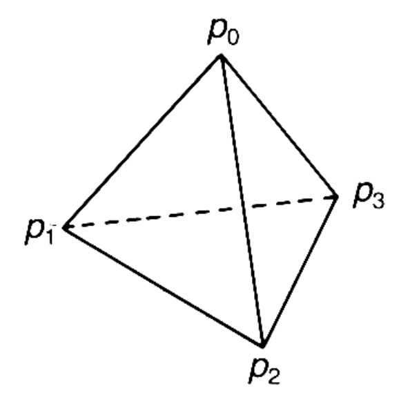
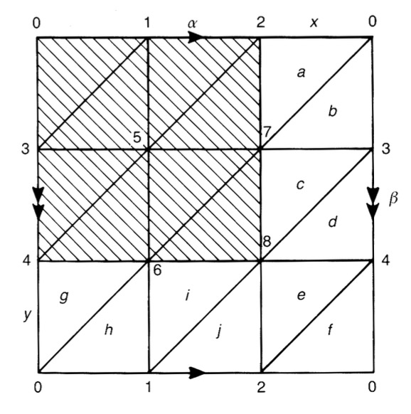

# Smith 标准型与同调群的一般计算

首先是在写作业时想到能否用计算机自动计算各种曲面剖分的同调群。简单调研后发现这是可以做到的，而且出乎意料地简单！同调群这一看似抽象的概念实际上完全可以用线性代数的语言描述和计算。

各种同调群最终都是在一个链复形上计算一个商群。只考虑整系数情形，这类问题一般都能通过 3 步得到：

1. 得到链复形上边缘算子的矩阵表示；
2. 计算边缘算子矩阵的 Smith 标准型；
3. 根据边缘算子矩阵的秩，以及 Smith normal form 对角项，写出各阶同调群。

本文中首先介绍整系数矩阵的 Smith 分解，再说明怎样利用边缘算子的 Smith 分解直接读出同调群。本文中的同调群默认为整系数同调群。

## Smith 标准型
对于任意一个整系数矩阵(不要求是方阵，不要求满秩)，总可以将其化为 Smith normal form，形式为：

$$
A_{m\times n}=U_{m\times m}D_{m\times n}V_{n\times n},
$$

其中 $U, V$ 是整系数、可逆的矩阵(逆矩阵也是整系数)。而 $D$ 是“对角化”的矩阵 

$$
D=\left(\begin{array}{ccccc}
\lambda_{1} &  &  &  & 0\\
 & \ddots\\
 &  & \lambda_{r}\\
 &  &  & 0\\
0 &  &  &  & \ddots
\end{array}\right),
$$

其中 $\lambda_{i}$ 是整数，同时 $\lambda_{i}$ 总整除 $\lambda_{i+1}$.

以上是 Smith 标准型的定义。实际上，从一个整系数矩阵出发得到此“对角化”形式并不困难(相对于本征值问题而言)。下面简述思路:

得到一个 Smith 标准型大致可分为 3 步：

1. 选取主元；
2. 利用行变换级列变换将矩阵消为对角形式；
3. 继续利用行列变换将对角元化为依次整除的形式。

其中每一步我们只用下面几种矩阵的基本变换，这些变换都对应到左乘或右乘 $U,V$：

1. 将第 i 行乘整系数加到 j 行；
2. 将第 i 列乘整系数加到 j 列；
3. 互换第 i 行与第 j 行；
4. 互换第 i 列与第 j 列；
5. 将某行或某列元素全部取相反数。

这些都是我们在线性代数中熟悉的变换，每一步相当于左乘或右乘一个可逆的整系数矩阵。也就是说，我们只用这 4 种基本操作去改变矩阵使，相应的 $U,V$ 矩阵自然满足要求。$U,V$ 的具体形式与我们的讨论无关，因此我们可以把目光完全放在用基本变换消去矩阵元上。接着我们可以用一个标准流程给出 Smith 标准型：

1. 现在我们我们从矩阵的 $(1,1)$ 位置矩阵元出发。如果是 $0$，则通过行或列交换重新选主元，把 $(1,1)$ 矩阵元变为非零；
2. 利用行变换和辗转相除法，把跟主元同行及同列的元素消为 $0$；
3. 从 $(2,2)$ 矩阵元开始，重复步骤 1,2, 直到除了对角元以外全变为 $0$；
4. 从如果相邻两个对角元不整除，用行列变换在非对角元上加出它们的最小公倍数，在用行列变换消成对角整除的形式。

对第 4 步具体举例：

$$
\left(\begin{array}{cc}
8 & 0\\
0 & 12
\end{array}\right)\rightarrow\left(\begin{array}{cc}
8 & 4\\
0 & 12
\end{array}\right)\rightarrow\left(\begin{array}{cc}
8 & 4\\
-24 & 0
\end{array}\right)
$$

$$
\rightarrow\left(\begin{array}{cc}
0 & 4\\
-24 & 0
\end{array}\right)\rightarrow\left(\begin{array}{cc}
4 & 0\\
0 & -24
\end{array}\right)\rightarrow\left(\begin{array}{cc}
4 & 0\\
0 & 24
\end{array}\right)
$$
这样，我们就从任意整系数矩阵出发得到了 Smith 标准型。可以证明这样的 Smith 分解的结果是唯一的。

Smith 分解是一个机械性的工作，实际上我们可以方便地使用现成的算法高效地给出一个矩阵的 Smith 分解。其中包括 `Mathematica` 内置的 `SmithDecomposition` 函数。

## 链复形的同调群
本节我们首先规定下我们的记号。各种同调群的核心对象是一个链复形：

$$
0\stackrel{i}{\longrightarrow}C_{n}\stackrel{\partial_{n}}{\longrightarrow}C_{n-1}\stackrel{\partial_{n-1}}{\longrightarrow}\cdots\stackrel{\partial_{1}}{\longrightarrow}C_{0}\stackrel{\partial_{0}}{\longrightarrow}0
$$

其中每个 $C_{i}$ 都是一个阿贝尔群，边缘算子$\partial_{i}$ 给出了从 $C_{i}$ 到 $C_{i+1}$
的同态，要求两次边缘算子作用总将任意元素映射到 0: $\partial_{i-1}\circ\partial_{i}=0$. 对每个
i 边缘算子 $\partial_{i}$ 的 Kernel (定义为 $Z_{i}$) 是 $C_{i}$ 的子群，而 $C_{i+1}$
在 $\partial_{i+1}$ 作用下的像(定义为 $B_{i}$) 一定是 $Z_{i}$ 的子群。它们之间的商群 $H_{i}:=Z_{i}/B_{i}$
定义了链复形第 i 阶同调群。

这样的定义略微抽象，给人一种同调群计算是一个复杂的抽象代数问题的感觉。但实际上以上定义完全可以叙述成一个简单的线性代数问题，对于每个阿贝尔群
$C_{i}$, 所有的元素都能表示为

$$
C_{i}=\left\{ \left.x_{1}e_{1}+x_{2}e_{2}+\cdots x_{n}e_{n}\right|x_{i}\in\mathbb{Z}\right\} .
$$

所有这样的元素实际就是构成一个整系数的线性空间。边缘算子 $\partial_{i}$ 构成两个这样的线性空间的映射，我们可以用一个整系数矩阵
$M_{i}$ 表示它。边缘算子幂零的要求现在变为一个很具体的限制：

$$
M_{i-1}M_{i}=0.
$$

以上是一些定义。下面我们看 Smith 分解是怎样和同调群产生联系的。

对于不同的同调群，$C_{i}$ 与 $\partial_{i}$ 的定义都有所不同。这里我们假定每一个群 $C_{i}$ 和边缘算子
$\partial_{i}$ 都不太复杂，使得我们可以写出边缘算子的具体矩阵形式 $M_{i}$。

现在我们盯住链复形的第 i 阶附近：

$$
\cdots\stackrel{}{\longrightarrow}C_{i+1}^{(l)}\stackrel{M_{i+1}}{\longrightarrow}C_{i}^{(n)}\stackrel{M_{i}}{\longrightarrow}C_{i-1}^{(m)}\stackrel{}{\longrightarrow}\cdots
$$

其中我们设 $C_{i+1},C_{i},C_{i-1}$ 分别为 $l,n,m$ 维线性空间。因此 $M_{i+1},M_{i}$
分别为具体的两个 $\left(n\times l\right),\left(m\times n\right)$ 型矩阵。计算同调群实际上就是计算矩阵
$M_{i}$ 的零空间模掉矩阵 $M_{i+1}$ 的像的商空间(再次强调所有概念均定义在整系数上)。而且一般问题往往只需要商空间的结构(类似于商空间有几维)，而不用知道这个空间具体的样子。

下面我们根据定义，计算同调群：

首先对于 $M_{i}$，假设矩阵秩为 s，则矩阵零空间维数为 (n-s). 然后我们要考虑 $M_{i+1}$ 矩阵的像。利用上节的算法，将
$M_{i+1}$ 做 Smith 分解：

$$
M_{i+1}=UD^{(r)}V,
$$

其中设矩阵 $D$ 中有 r 个非零对角元(即 $M_{i+1}$ 秩为 r)。这里 U,V 矩阵相当于一个基变换，它们的作用是平庸的，我们只考虑矩阵
D 的作用。D 作用下的像为一个 r 维线性空间，注意这个 r 维线性空间完全包含在 $M_{i}$ 的零空间里。一般来说，一个
(n-s) 维空间，模掉一个 r 维子空间，得到的商空间是一个 (n-s-r) 维线性空间，即

$$
H_{i}\cong\mathbb{Z}^{(n-s-r)},
$$

但这不完全正确。考虑原先的一组基：$\left\{ e_{1},\cdots,e_{l}\right\}$，在 D 作用后变为
$\left\{ \lambda_{1}e_{1},\cdots,\lambda_{r}e_{r}\right\}$. 我们看到每个基底被扩大了
$\lambda_{i}$ 倍，这是整系数线性空间特有的现象。我们可以想像对于一个形如 $\lambda_{i}e_{i}$ 的基底，它张成的空间只覆盖到
$\mathbb{Z}$ 的 $1/\lambda_{i}$, 也就是说，同调群除了那 (n-s-r) 个实打实的余维数，还多出
r 个循环群：

$$
H_{i}\cong\mathbb{Z}^{(n-s-r)}\oplus\mathbb{Z}_{\lambda_{1}}\oplus\cdots\oplus\mathbb{Z}_{\lambda_{r}}.
$$

这样我们就算出了这个链复形第 i 阶同调群。

这里有一个小细节没有说明，我们在做 Smith 标准型时为什么要求 $\lambda_{i}$ 整除 $\lambda_{i+1}$?
这可以看成多出的这些子空间 $\mathbb{Z}_{\lambda_{1}}\oplus\cdots\oplus\mathbb{Z}_{\lambda_{r}}$
一个“最干净”的分解，更精确的叙述可以由有限生成阿贝尔群结构定理给出。

## 单纯形同调群计算举例
以上是同调群计算一般的描述。下面我们在单纯形同调的框架里，利用我们这个算法算几个曲面的同调群作为例子。

单纯形及三角剖分的定义这里不再赘述。我们计算球面和轮胎面的各阶同调群，说明这两个曲面拓扑不等价。这里链复形可写为：

$$
0\stackrel{i}{\longrightarrow}C_{2}\stackrel{M_{2}}{\longrightarrow}C_{1}\stackrel{M_{1}}{\longrightarrow}C_{0}\stackrel{M_{0}}{\longrightarrow}0
$$

先算简单的。球面的三角剖分就是个四面体。

3 个线性空间为：

$$
\begin{eqnarray}
C_{0}^{(4)} & = & span\left\{ p_{0},p_{1},p_{2},p_{3}\right\} \\
C_{1}^{(6)} & = & span\left\{ (01),(02),(03),(12),(13),(23)\right\} \\
C_{2}^{(4)} & = & span\left\{ (123),(023),(013),(012)\right\} 
\end{eqnarray}
$$

按这个次序，写下每个矩阵 $M_{i}$ ：

$$
M_{2}=\left(\begin{array}{cccc}
0 & 0 & 1 & 1\\
0 & 1 & 0 & -1\\
0 & -1 & -1 & 0\\
1 & 0 & 0 & 1\\
-1 & 0 & 1 & 0\\
1 & 1 & 0 & 0
\end{array}\right),
$$

$$
M_{1}=\left(\begin{array}{cccccc}
-1 & -1 & -1 & 0 & 0 & 0\\
1 & 0 & 0 & -1 & -1 & 0\\
0 & 1 & 0 & 1 & 0 & -1\\
0 & 0 & 1 & 0 & 1 & 1
\end{array}\right),
$$

$$
M_{0}=\left(\begin{array}{ccc}
0 & 0 & 0\end{array}\right).
$$

用 Mathematica 的 SmithDecomposition 函数，得到 Smith 标准型：

$$
D_{2}=\left(\begin{array}{cccc}
1 & 0 & 0 & 0\\
0 & 1 & 0 & 0\\
0 & 0 & 1 & 0\\
0 & 0 & 0 & 0\\
0 & 0 & 0 & 0\\
0 & 0 & 0 & 0
\end{array}\right),
$$

$$
D_{1}=\left(\begin{array}{cccccc}
1 & 0 & 0 & 0 & 0 & 0\\
0 & 1 & 0 & 0 & 0 & 0\\
0 & 0 & 1 & 0 & 0 & 0\\
0 & 0 & 0 & 0 & 0 & 0
\end{array}\right).
$$

因此这个链复形不会出现那种情况。现在我们直接写出各阶同调群：

**0 阶**:

$$
n=4,r=3,s=0,
$$

$$
H_{0}\cong\mathbb{Z}^{(n-r-s)}=\mathbb{Z}.
$$

**1 阶**:

$$
n=3,r=3,s=3,
$$

$$
H_{1}\cong\left\{ 0\right\} .
$$

**2 阶**:

$$
n=4,r=0,s=3,
$$

$$
H_{2}\cong\mathbb{Z}.
$$

下面计算轮胎面。

轮胎面的三角剖分比较复杂，但同样可以按部就班地做出同调群来：

$$
C_{0}^{(9)}=span\left\{ p_{0},\cdots,p_{8}\right\} 
$$

$$
\begin{eqnarray}
C_{1}^{(27)} & = & span\left\{ (01),(02),(03),(04),(06),(07),(12),(13),\right.\nonumber \\
 &  & (15),(16),(18),(24),(25),(27),(28),(34),(35),(37),\nonumber \\
 &  & \left.(38),(45),(46),(48),(56),(57),(67),(68),(78)\right\} 
\end{eqnarray}
$$

$$
\begin{eqnarray}
C_{2}^{(18)} & = & span\left\{ (013),(135),(125),(257),(207),(073),\right.\nonumber \\
 &  & (354),(546),(576),(768),(738),(384),\nonumber \\
 &  & \left.(460),(601),(681),(812),(842),(420)\right\} 
\end{eqnarray}
$$

可以想象，当剖分变得较复杂时，边缘算子的矩阵是一个很稀疏的形式，我们可以很容易地写一个小程序来填这个矩阵。

矩阵 $M_{2}$ 为：

$$
\left(\begin{array}{cccccccccccccccccc}
1 & 0 & 0 & 0 & 0 & 0 & 0 & 0 & 0 & 0 & 0 & 0 & 0 & 1 & 0 & 0 & 0 & 0\\
0 & 0 & 0 & 0 & -1 & 0 & 0 & 0 & 0 & 0 & 0 & 0 & 0 & 0 & 0 & 0 & 0 & -1\\
-1 & 0 & 0 & 0 & 0 & -1 & 0 & 0 & 0 & 0 & 0 & 0 & 0 & 0 & 0 & 0 & 0 & 0\\
0 & 0 & 0 & 0 & 0 & 0 & 0 & 0 & 0 & 0 & 0 & 0 & 1 & 0 & 0 & 0 & 0 & 1\\
0 & 0 & 0 & 0 & 0 & 0 & 0 & 0 & 0 & 0 & 0 & 0 & -1 & -1 & 0 & 0 & 0 & 0\\
0 & 0 & 0 & 0 & 1 & 1 & 0 & 0 & 0 & 0 & 0 & 0 & 0 & 0 & 0 & 0 & 0 & 0\\
0 & 0 & 1 & 0 & 0 & 0 & 0 & 0 & 0 & 0 & 0 & 0 & 0 & 0 & 0 & 1 & 0 & 0\\
1 & 1 & 0 & 0 & 0 & 0 & 0 & 0 & 0 & 0 & 0 & 0 & 0 & 0 & 0 & 0 & 0 & 0\\
0 & -1 & -1 & 0 & 0 & 0 & 0 & 0 & 0 & 0 & 0 & 0 & 0 & 0 & 0 & 0 & 0 & 0\\
0 & 0 & 0 & 0 & 0 & 0 & 0 & 0 & 0 & 0 & 0 & 0 & 0 & 1 & 1 & 0 & 0 & 0\\
0 & 0 & 0 & 0 & 0 & 0 & 0 & 0 & 0 & 0 & 0 & 0 & 0 & 0 & -1 & -1 & 0 & 0\\
0 & 0 & 0 & 0 & 0 & 0 & 0 & 0 & 0 & 0 & 0 & 0 & 0 & 0 & 0 & 0 & -1 & -1\\
0 & 0 & 1 & 1 & 0 & 0 & 0 & 0 & 0 & 0 & 0 & 0 & 0 & 0 & 0 & 0 & 0 & 0\\
0 & 0 & 0 & -1 & -1 & 0 & 0 & 0 & 0 & 0 & 0 & 0 & 0 & 0 & 0 & 0 & 0 & 0\\
0 & 0 & 0 & 0 & 0 & 0 & 0 & 0 & 0 & 0 & 0 & 0 & 0 & 0 & 0 & 1 & 1 & 0\\
0 & 0 & 0 & 0 & 0 & 0 & -1 & 0 & 0 & 0 & 0 & -1 & 0 & 0 & 0 & 0 & 0 & 0\\
0 & 1 & 0 & 0 & 0 & 0 & 1 & 0 & 0 & 0 & 0 & 0 & 0 & 0 & 0 & 0 & 0 & 0\\
0 & 0 & 0 & 0 & 0 & -1 & 0 & 0 & 0 & 0 & -1 & 0 & 0 & 0 & 0 & 0 & 0 & 0\\
0 & 0 & 0 & 0 & 0 & 0 & 0 & 0 & 0 & 0 & 1 & 1 & 0 & 0 & 0 & 0 & 0 & 0\\
0 & 0 & 0 & 0 & 0 & 0 & -1 & -1 & 0 & 0 & 0 & 0 & 0 & 0 & 0 & 0 & 0 & 0\\
0 & 0 & 0 & 0 & 0 & 0 & 0 & 1 & 0 & 0 & 0 & 0 & 1 & 0 & 0 & 0 & 0 & 0\\
0 & 0 & 0 & 0 & 0 & 0 & 0 & 0 & 0 & 0 & 0 & -1 & 0 & 0 & 0 & 0 & -1 & 0\\
0 & 0 & 0 & 0 & 0 & 0 & 0 & -1 & -1 & 0 & 0 & 0 & 0 & 0 & 0 & 0 & 0 & 0\\
0 & 0 & 0 & 1 & 0 & 0 & 0 & 0 & 1 & 0 & 0 & 0 & 0 & 0 & 0 & 0 & 0 & 0\\
0 & 0 & 0 & 0 & 0 & 0 & 0 & 0 & -1 & -1 & 0 & 0 & 0 & 0 & 0 & 0 & 0 & 0\\
0 & 0 & 0 & 0 & 0 & 0 & 0 & 0 & 0 & 1 & 0 & 0 & 0 & 0 & 1 & 0 & 0 & 0\\
0 & 0 & 0 & 0 & 0 & 0 & 0 & 0 & 0 & -1 & -1 & 0 & 0 & 0 & 0 & 0 & 0 & 0
\end{array}\right)
$$
Smith 标准型的非零对角元为 $17$ 个 $1$.

矩阵 $M_{1}$ 为：

$$
\left(\begin{array}{ccccccccc}
-1 & 1 & 0 & 0 & 0 & 0 & 0 & 0 & 0\\
-1 & 0 & 1 & 0 & 0 & 0 & 0 & 0 & 0\\
-1 & 0 & 0 & 1 & 0 & 0 & 0 & 0 & 0\\
-1 & 0 & 0 & 0 & 1 & 0 & 0 & 0 & 0\\
-1 & 0 & 0 & 0 & 0 & 0 & 1 & 0 & 0\\
-1 & 0 & 0 & 0 & 0 & 0 & 0 & 1 & 0\\
0 & -1 & 1 & 0 & 0 & 0 & 0 & 0 & 0\\
0 & -1 & 0 & 1 & 0 & 0 & 0 & 0 & 0\\
0 & -1 & 0 & 0 & 0 & 1 & 0 & 0 & 0\\
0 & -1 & 0 & 0 & 0 & 0 & 1 & 0 & 0\\
0 & -1 & 0 & 0 & 0 & 0 & 0 & 0 & 1\\
0 & 0 & -1 & 0 & 1 & 0 & 0 & 0 & 0\\
0 & 0 & -1 & 0 & 0 & 1 & 0 & 0 & 0\\
0 & 0 & -1 & 0 & 0 & 0 & 0 & 1 & 0\\
0 & 0 & -1 & 0 & 0 & 0 & 0 & 0 & 1\\
0 & 0 & 0 & -1 & 1 & 0 & 0 & 0 & 0\\
0 & 0 & 0 & -1 & 0 & 1 & 0 & 0 & 0\\
0 & 0 & 0 & -1 & 0 & 0 & 0 & 1 & 0\\
0 & 0 & 0 & -1 & 0 & 0 & 0 & 0 & 1\\
0 & 0 & 0 & 0 & -1 & 1 & 0 & 0 & 0\\
0 & 0 & 0 & 0 & -1 & 0 & 1 & 0 & 0\\
0 & 0 & 0 & 0 & -1 & 0 & 0 & 0 & 1\\
0 & 0 & 0 & 0 & 0 & -1 & 1 & 0 & 0\\
0 & 0 & 0 & 0 & 0 & -1 & 0 & 1 & 0\\
0 & 0 & 0 & 0 & 0 & 0 & -1 & 1 & 0\\
0 & 0 & 0 & 0 & 0 & 0 & -1 & 0 & 1\\
0 & 0 & 0 & 0 & 0 & 0 & 0 & -1 & 1
\end{array}\right)^{T}
$$

Smith 标准型的非零对角元为 8 个 1. 因此读出同调群为：

**0 阶**:

$$
n=9,r=8,s=0,
$$

$$
H_{0}\cong\mathbb{Z}.
$$

**1 阶**:

$$
n=27,r=17,s=8,
$$

$$
H_{1}\cong\mathbb{Z}^{2}.
$$

**2 阶**:

$$
n=18,r=0,s=17,
$$

$$
H_{2}\cong\mathbb{Z}.
$$

我们看到 1 阶同调群可区分这两个曲面。

## 小结
单纯形上同调在物理中也许并没有太多用处，这种基于三角剖分的办法难以更高维的流形。但所有的同调群计算几乎全都基于链复形和边缘算子，只要我们清楚每一阶链群，并且有方法给出每一阶边缘算符的具体矩阵形式，那么同调群的计算都是一样的。

在这个意义上，同调群的计算基本可以认为是一个线性代数问题。
