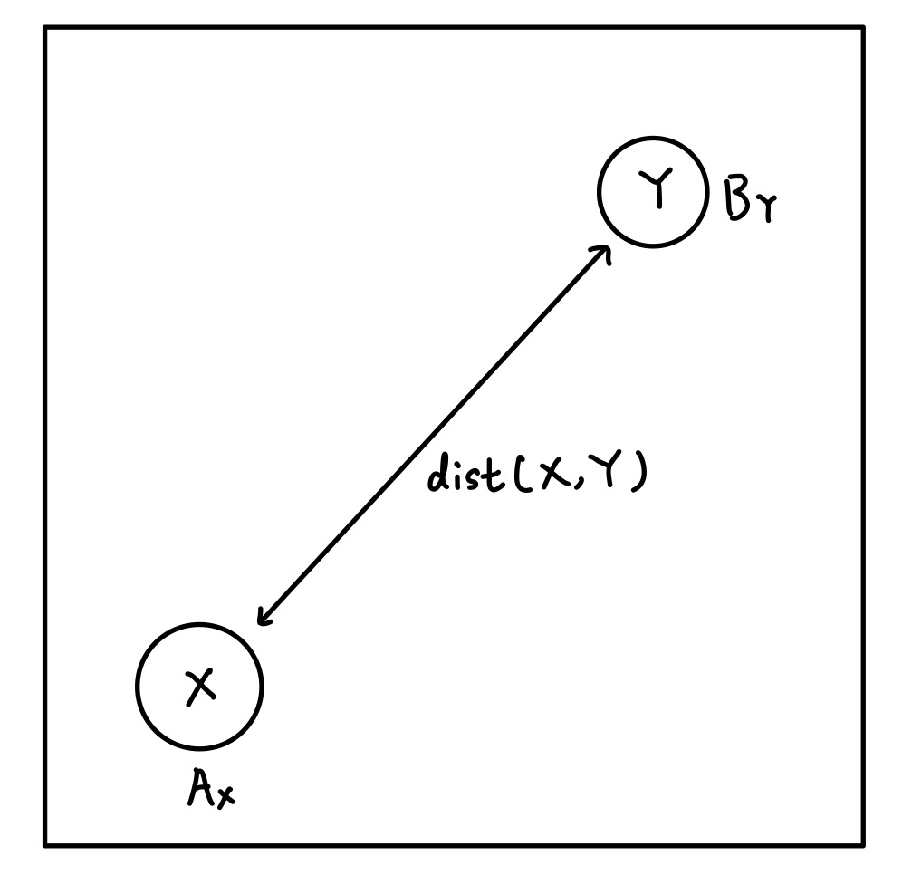
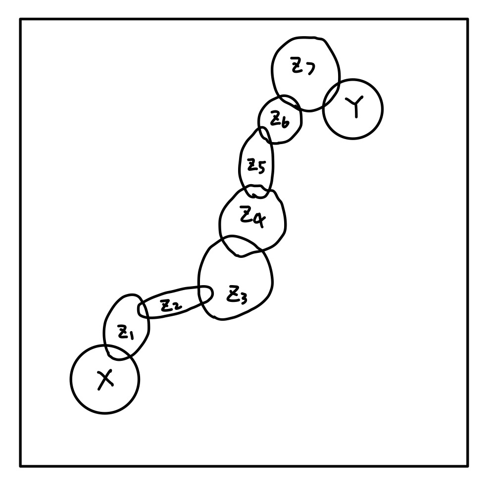

# Lieb-Robinson bound

Lieb-Robinson bound 给出了非相对论多体系统中信息传播速度的一个上界。这个定理告诉我们，即使我们的考虑完全忽略相对论的多体系统，在局域的哈密顿量演化下，多体系统仍然不能超距地传递信息。这个定理除了给出信息传播速度上限之外，还能证明有能隙、无简并的系统基态关联函数随距离指数衰减，而后者和基态纠缠熵面积律有直接关系(详见参考文献[4],[5])。下面的证明主要 follow M. B. Hastings 的一个 note(参考文献[2])，但我们这里对“算符局域性”做了比 Hastings 文中稍强些的限制，这样会使得证明更简单些。

## 多体系统中的局域性

我们在这里先对多体系统的“局域性”做简要说明。我们这里只考虑格点系统。假设每个格点上承载一个 $d$ 维希尔伯特空间 $\mathcal H_i \cong \mathbb{C}^d$，则整个多体希尔伯特空间为这些格点希尔伯特空间的张量积：

$$
	\mathcal H = \bigotimes_{i} \mathcal{H}_i.
$$

而局域算符的定义是在这个张量积结构中，算符只在有限范围内的格点有非平庸的定义：

$$
	\hat O = \hat{O}_X \otimes 1_{\bar X},
$$

其中 $X$ 是有限($X$ 上格点数有上界，$|X|<\infty$)且空间上有界($X$ 内部最大距离有上界，
$\mathrm{diam}(X)<\infty$)。以下我们考虑一类局域哈密顿量：

$$
	\hat H = \sum_X \hat H_{X}
$$

其中 $\hat H_X$ 是定义在区域 $X$ 上的算符，满足：

- 算符的是局域的，即 $|X| \le k,\ \mathrm{diam}(X) \le r$;
- 算符是有界的，即 $\Vert \hat H_X \Vert \le h$;
- 包含格点 $i$ 的算符数量是有限的，至多为 $m$.

Lieb-Robinson bound 关心的对象是在海森堡表象下，在两个不相交的区域 $X,Y$ 上定义的两个算符 $\hat{A}_X,\hat{B}_Y$ 的对易子 $[\hat A_X(t),\hat B_Y]$. 显然，在零时刻对易子为零，一个直接的想法是 $X$ 处算符的信息传递到 $Y$ 需要一个时间 $t^*$，当 $t<t^*$ 时对易子为零。

但我们马上会发现这是不对的。只要 $t>0$，对易子就不为零，这个与直观不符合的原因在于我们描述系统的理论是一个非相对论理论，因此没有严格的“光锥”。然而 Lieb-Robinson 某种程度上调和了这个矛盾，指出虽然对易子不严格为零，但一个局域哈密顿量描述的体系存在一个特征速度 $v_{LR}$，称为 Lieb-Robinson 速度，超过的个速度的对易子随着距离增大，其值是指数衰减的。Lieb-Robinson bound 的数学描述为：

$$
	\Vert [\hat A_X(t),\hat B_Y] \Vert \le
	2 \Vert \hat A_X \Vert \Vert \hat B_Y \Vert |X| e^{-a \mathrm{dist}(X,Y)}(e^{av_{LR}|t|}-1)
	\le c\ e^{-a(\mathrm{dist}(X,Y)-v_{LR}t)}.
$$

其中 $\mathrm{dist}(X,Y)$ 是区域 $X,Y$ 之间的距离，$a,v_{LR}$ 是系统依赖的常数。

## 定理证明

令 $\hat F(t) \equiv [\hat A_X(t),\hat B_Y] $，首先有：

$$
	\Vert \hat{F}(t) \Vert = \int_0^t \frac{d}{dt} \left\Vert \hat{F}(\tau) \right\Vert d\tau
$$

我们先看算符 $\hat F(t)$ 的求导项：

$$
	\frac{d}{dt} \hat{F}(t) = i \left[[\hat H, \hat A_X(t)], \hat B_Y \right].
$$

其中对于对易子 $[\hat H, \hat A_X(t)]$，可以将演化算符移到对易子外：

$$
	[\hat H, \hat A_X(t)] = e^{i \hat H t} [\hat H, \hat A_X] e^{-i \hat H t}
$$

此时对于不含时的对易子 $[\hat H, \hat A_X]$，有贡献的只有哈密顿量中与区域 $X$ 有交的算符，即

$$
	[\hat H, \hat A_X] = [\hat I_{X_1}, \hat A_X]
$$

其中 $\hat I_{X_1}$ 是哈密顿量中与 $X$ 有交的算符之和：

$$
	\hat I_{X_1} = \sum_{X_1:X_1 \cap X \ne 0} H_{X_1}.
$$

代入原求导式：

$$
\begin{eqnarray}
	\frac{d}{dt}\hat{F}(t)
	&=& i\left[e^{i\hat{H}t} \left[\hat I_{X_1}, \hat A_X \right] e^{-i \hat{H} t}, \hat B_Y \right] \nonumber \\
	&=& i\left[ \left[\hat I_{X_1}(t), \hat A_X(t) \right], \hat B_Y \right] \nonumber \\
	&=& i\left[\hat I_{X_1}(t), [\hat A_X(t), \hat B_Y] \right] + i\left[[\hat I_{X_1}(t), \hat B_Y], \hat A_X(t) \right] \nonumber \\
	&\equiv & i\left[\hat I_{X_1}(t), \hat{F}(t) \right] + i\hat{G}
\end{eqnarray}
$$

其中 $\hat{G} \equiv \left[[\hat I_{X_1}(t), \hat B_Y], \hat A_X(t) \right]$，最后一个等式利用了雅可比恒等式。实际上，第一项对应一个幺正演化，该演化是保范数的，为看出这点，我们将 $\hat F(t)$ 改写为

$$
\begin{eqnarray}
	\hat{F}(t) \equiv \hat{U}^{\dagger}(t) \hat{f}(t) \hat{U}(t),
\end{eqnarray}
$$

其中幺正演化算符为

$$
	\hat{U}(t) \equiv \exp\left(-i\int_0^t \hat{I}_{X_1}(\tau) d\tau \right).
$$

代入上式得到：

$$
\begin{eqnarray}
	\frac{d}{dt}\hat{f}(t) 
	&=& i \hat{U}(t)\hat{G}\hat{U}^{\dagger}(t),
\end{eqnarray}
$$

现在我们利用上面的结果计算范数求导的表达式：

$$
\begin{eqnarray}
	\frac{d}{dt} \left\Vert \hat{F}(t) \right\Vert 
	&=& \frac{d}{dt} \left\Vert \hat{f}(t) \right\Vert  \nonumber \\
	&\le & \left\Vert \frac{d}{dt}\hat{f}(t) \right\Vert  \nonumber \\
	&=& \left\Vert \hat G \right\Vert \nonumber \\
	&\le & 2\Vert \hat{A}_X \Vert \Vert [\hat{I}_{X_1}(t), \hat B_Y] \Vert \nonumber \\
\end{eqnarray}
$$

因此得到：

$$
\begin{eqnarray}
	\Vert [\hat{A}_X(t), \hat B_Y] \Vert 
	&\le & 2 \Vert \hat{A}_X \Vert \int_0^t \Vert [\hat{I}_{X_1}(\tau), \hat B_Y] \Vert d\tau \nonumber \\
	&=& 2 \Vert \hat{A}_X \Vert \sum_{Z_1 \in X_1} \int_0^t \Vert [\hat{H}_{Z_1}(\tau), \hat B_Y] \Vert d\tau
\end{eqnarray}
$$

其中 $X_1 = \{Z_1|Z_1 \cap X \ne 0\}$.现在我们将 $\hat{H}_{X}(t)$ 视为 $\hat A_X(t)$，可以套用上面的结论：

$$
\begin{eqnarray}
	\Vert [\hat{H}_{Z_1}(t), \hat B_Y] \Vert
	\le \Vert [\hat{H}_{Z_1}, \hat B_Y] \Vert + 2\Vert\hat{H}_{X_1}\Vert \sum_{Z_2 \in X_2} \int_0^t \Vert [\hat{H}_{Z_2}(\tau), \hat B_Y] \Vert d\tau
\end{eqnarray}
$$

其中 $X_2 = \{Z_2|Z_2 \cap Z_1 \ne 0\}$. 这个过程可以递归地进行下去，最后得到：

$$
\begin{eqnarray}
	\Vert [\hat{A}_X(t), \hat B_Y] \Vert
	&\le & 2 \Vert \hat{A}_X \Vert \sum_{Z_1\in X_1} \int_0^t d\tau \Vert [\hat{H}_{X_1}, \hat B_Y] \Vert \nonumber \\
	& + & 2 \Vert \hat{A}_X \Vert \sum_{Z_1 \in X_1} 2 \Vert \hat{H}_{Z_1} \Vert \sum_{Z_2 \in X_2} \int_0^t d\tau_1\int_0^{\tau_1} d\tau_2 \Vert [\hat{H}_{Z_2}, \hat B_Y] \Vert + \cdots.
\end{eqnarray}
$$

注意每个求和项均中对易子均不含时，对易子的范数有上界：

$$
\begin{eqnarray}
	\Vert[\hat{H}_{Z_n},\hat{B}_{Y}]\Vert \le 2 \Vert \hat{H}_{Z_n} \Vert \Vert \hat{B}_{Y} \Vert \le 2h \Vert \hat{B}_{Y} \Vert.
\end{eqnarray}
$$

这样，求和式可以写为级数：

$$
\begin{eqnarray}
	\Vert [\hat{A}_X(t), \hat B_Y] \Vert 
	\le 2\Vert \hat{A}_X \Vert \Vert\hat{B}_Y\Vert \sum_{n=1}^{\infty} \frac{(2ht)^n}{n!} \sum_{X_1} \sum_{X_2} \cdots \sum_{X_n} 1.
\end{eqnarray}
$$

我们现在重点考察求和式。这个求和式实际上有些“路径积分”的意义。总的求和是找到所有这样的“路径”，这些“路径”由哈密顿量中的算符 $H_{Z_n}$ 手拉手从 $X$ 走到 $Y$。

我们可以给这个求和一个比较宽的上界。考虑完全“随机行走”，每步走出的“脚印” $H_{Z_i}$ 至多有 $m$ 个格点，按我们之前对系统的一般要求，下一步至多有 $mk$ 种走法，因此 $n$ 步随机行走至多有 $(mk)^n$ 条“路径”。另外，考虑到每步之多走距离 $r$，在 $nr < \mathrm{dist}(X,Y)$ 时一定无法从 $X$ 走到 $Y$，我们可以用一个指数函数

$$
	e^{-a(\mathrm{dist}(X,Y)+ nr)}
$$

控制这个限制。因此得到：

$$
\begin{eqnarray}
	\sum_{X_1} \cdots \sum_{X_n} 1
	\le (mk)^n e^{-a(\mathrm{dist}(X,Y)+ nr)}
\end{eqnarray}
$$

代回原来的级数求和式，得到：

$$
\begin{eqnarray}
	\Vert [\hat{A}_X(t), \hat B_Y] \Vert 
	&\le & 2\Vert \hat{A}_X \Vert \Vert\hat{B}_Y\Vert \sum_{n=1}^{\infty} \frac{(2hrme^{ar}t)^n}{n!} e^{-a\mathrm{dist}(X,Y)} \nonumber \\
	&=& 2\Vert \hat{A}_X \Vert \Vert\hat{B}_Y\Vert e^{-a\mathrm{dist}(X,Y)} (e^{av_{LR}t}-1) \\
	&\le & c\ e^{-a(\mathrm{dist}(X,Y)-v_{LR}t)}
\end{eqnarray}
$$

其中 Lieb-Robinson 速度为 $v_{LR} = 2hrme^{ar}/a$.

## 有能隙体系基态的关联衰减

现在我们来看 Lieb-Robinson bound 一个推论，即对于一个基态不简并且有能隙的体系，关联函数

$$
\begin{eqnarray}
	\langle 0| \hat A_X \hat B_Y |0\rangle - \langle 0| \hat A_X |0\rangle \langle 0|\hat B_Y |0\rangle
\end{eqnarray}
$$

总是指数衰减的。我们接下来总假设 $\langle 0| \hat A_X |0\rangle, \langle 0| \hat B_Y |0\rangle = 0$，此时关联函数为

$$
	C_{AB} = \langle 0| \hat A_X, \hat B_Y |0\rangle.
$$

我们可以将关联函数与对易子建立一种联系。首先将算符 $\hat B_Y$ 分解为正频和负频部分：

$$
\begin{eqnarray}
	\hat B_Y = \hat{B}_{Y}^{+} + \hat{B}_{Y}^{-}
\end{eqnarray}
$$

其中

$$
\begin{eqnarray}
	\langle m| \hat B_{Y}^{+} | n\rangle &\equiv & \langle m| \hat B_{Y} | n\rangle \theta(E_m-E_n), \\
	\langle m| \hat B_{Y}^{-} | n\rangle &\equiv & \langle m| \hat B_{Y} | n\rangle \theta(E_n-E_m).
\end{eqnarray}
$$

此时，关联函数可以写为：

$$
\begin{eqnarray}
	C_{AB} =
	\langle 0| [\hat A_{X}, \hat B_{Y}^{+}] |0\rangle.
\end{eqnarray}
$$

我们发现 $\hat{B}_{Y}^{+}$ 可以写为：

$$
\begin{eqnarray}
	\hat{B}_{Y}^{+} = \frac{1}{2\pi i} \lim_{\epsilon\rightarrow 0} \int dt \frac{\hat{B}_{Y}(t)}{t-i\epsilon}
\end{eqnarray}
$$

这是由于

$$
\begin{eqnarray}
	\langle m| \hat B_{Y}^{+} | n\rangle
	&=& \frac{1}{2\pi i} \lim_{\epsilon\rightarrow 0} \int dt \frac{\langle m| \hat B_{Y}(t) | n\rangle}{t-i\epsilon} \nonumber \\
	&=& \frac{1}{2\pi i} \lim_{\epsilon\rightarrow 0} \int dt \frac{e^{i(E_m-E_n)t}}{t-i\epsilon}\langle m| \hat B_{Y} | n\rangle \nonumber \\
	&=& \langle m| \hat B_{Y} | n\rangle \theta(E_m-E_n).
\end{eqnarray}
$$

然而，这个积分表达式在 $t \gg 1$ 时不容易帮助我们确定上界。一个解决办法是引入一个高斯函数控制 $t gg 1$ 部分的积分：

$$
\begin{eqnarray}
	\hat{B}_{Y,q}^{+} = \frac{1}{2\pi i} \lim_{\epsilon\rightarrow 0} \int dt \frac{\hat{B}_{Y}(t)}{t-i\epsilon} e^{-\frac{\Delta^2}{2q}t^2}
\end{eqnarray}
$$

这样，我们得到：

$$
\begin{eqnarray}
	|C_{AB}| &=& |\langle 0|[\hat{A}_X, \hat{B}_{Y,q}^{+} + (\hat{B}_{Y}^{+}-\hat{B}_{Y,q}^{+})]|0\rangle| \nonumber \\
	&\le & 
	\Vert [\hat{A}_X, \hat{B}_{Y,q}^{+}] \Vert + 
	\sum_n (\hat{A}_X)_{0n}(\hat{B}_{Y}^{+}-\hat{B}_{Y,q}^{+})_{n0} +
	\sum_n (\hat{B}_{Y}^{+}-\hat{B}_{Y,q}^{+})_{0n}(\hat{A}_X)_{n0}
\end{eqnarray}
$$

下面逐一定出右边三项的上界。先考虑第一项：

$$
\begin{eqnarray}
	\Vert [\hat{A}_X, \hat{B}_{Y,q}^{+}] \Vert
	\le \frac{1}{2\pi} \lim_{\epsilon\rightarrow 0} \int dt \Vert [\hat{A}_{X},\hat{B}_{Y}(t)] \Vert \left|\frac{1}{t-i\epsilon}\right| e^{-\frac{\Delta^2}{2q}t^2} 
\end{eqnarray}
$$

将积分区间分为两部分：$ v_{LR}t < \mathrm{dist}(X,Y)=l$ 时使用 Lieb-Robinson bound 控制上界，得到：

$$
\begin{eqnarray}
	I_{|t|<l/v_{LR}}
	&\le & c\ e^{-a \mathrm{dist}(X,Y)} \lim_{\epsilon \rightarrow 0} \int_{-l/v_{LR}}^{l/v_{LR}} \left|\frac{e^{av_{LR}t}-1}{t-i\epsilon} \right| e^{-\frac{\Delta^2}{2q}t^2} \nonumber \\
	&=& c'\ e^{-a \mathrm{dist}(X,Y)},
\end{eqnarray}
$$

反之，$ v_{LR}t > l $ 时使用高斯函数控制上界：

$$
\begin{eqnarray}
	I_{|t|>l/v_{LR}}
	&\le & c \int_{l/v_{LR}}^{\infty} e^{-\frac{\Delta^2}{2q}t^2} \nonumber \\
	&\le & c \int_{l/v_{LR}}^{\infty} e^{-\frac{\Delta^2}{2q} \frac{l}{v_{LR}}t} \nonumber \\
	&= & c' \exp\left(-\frac{\Delta^2 l^2}{2v_{LR}^{2}q} \right)
\end{eqnarray}
$$

现在考虑其余两项：

$$
\begin{eqnarray}
	I_2 &\le & c \sum_n \left|1-\lim_{\epsilon\rightarrow 0}\int dt \frac{1}{t-i\epsilon}e^{-\frac{\Delta^2}{2q}t^2}e^{i(E_n-E_0)t} \right|, \\
	I_3 &\le & c \sum_n \left| \lim_{\epsilon\rightarrow 0}\int dt \frac{1}{t-i\epsilon}e^{-\frac{\Delta^2}{2q}t^2}e^{i(E_n-E_0)} \right|.
\end{eqnarray}
$$

剩下需要计算的积分为：

$$
\begin{eqnarray}
	g(\omega) \equiv \lim_{\epsilon\rightarrow 0} \int dt \frac{1}{t-i\epsilon}e^{-\frac{\Delta^2}{2q}t^2}e^{i\omega t}
\end{eqnarray}
$$

此积分是一个傅立叶变换，利用傅立叶变换性质($\widetilde{f \cdot g} = \tilde{f} * \tilde{g}$)，上式化为

$$
\begin{eqnarray}
	g(\omega) 
	&=& \theta(\omega) * e^{-\frac{q}{2\Delta^2} \omega^2} \nonumber \\
	&=& \sqrt{\frac{q}{2\pi \Delta^2}}\int_{-\infty}^{\omega} e^{-\frac{q}{2\Delta^2} \eta^2} d\eta
\end{eqnarray}
$$

注意当 $\omega > \Delta$ 时：

$$
\begin{eqnarray}
	1 - g(\omega) 
	&\le & \sqrt{\frac{q}{2\pi \Delta^2}}\int_{\Delta}^{\infty} e^{-\frac{q}{2\Delta^2} \eta^2} d\eta \nonumber \\
	&\le & \sqrt{\frac{q}{2\pi \Delta^2}}\int_{\Delta}^{\infty} e^{-\frac{q}{2\Delta} \eta} d\eta \nonumber \\
	&\le & c\ e^{-q/2},
\end{eqnarray}
$$

而当 $\omega < -\Delta$ 时：

$$
\begin{eqnarray}
	g(\omega) 
	&\le & \sqrt{\frac{q}{2\pi \Delta^2}}\int_{-\infty}^{-\Delta} e^{-\frac{q}{2\Delta^2} \eta^2} d\eta \nonumber \\
	&\le & \sqrt{\frac{q}{2\pi \Delta^2}}\int_{-\infty}^{-\Delta} e^{\frac{q}{2\Delta} \eta} d\eta \nonumber \\
	&\le & c\ e^{-q/2},
\end{eqnarray}
$$

因此，第二第三项被控制为：

$$
\begin{eqnarray}
	I_2 &\le & c\ e^{-q/2}, \\
	I_3 &\le & c\ e^{-q/2}.
\end{eqnarray}
$$

总结一下，我们得到四个上界指数分别为 $\{-al, -\Delta^2l^2/2v_{LR}^2q, -q/2\}$. 注意 $q$ 是任意选取的，我们取平衡值 $q = \Delta l/v_{LR}$，这样，我们证明了关联函数的上界为：

$$
\begin{eqnarray}
	C_{AB} \le c_1 e^{-al} + c_2 e^{-\frac{\Delta l}{v_{LR}}l}.
\end{eqnarray}
$$

需要指出的是，有能隙、非简并系统的纠缠熵也满足一个很低的上界，称为纠缠熵“面积律”，即纠缠熵的值和我们将系统一分为二的截面积成正比。然而“面积律”的证明相比关联函数复杂的多。现在一维情况的面积律由 Hastings 在 07 年给出了严格证明(参考文献[4])，后来 Horodecki 在一维又给出了一个更强的结论(参考文献[5])。但高维情形的纠缠熵面积律似乎还没有严格证明(如果有误请指出)。

## References

1. E. H. Lieb, D. W. Robinson, The Finite Group Velocity of Quantum Spin Systems.
2. M. B. Hastings, Locality in Quantum Systems.
3. M. B. Hastings, T. Koma, Spectral Gap and Exponential Decay of Correlations.
4. M. B. Hastings, An area law for one-dimensional quantum systems.
5. F. Brandão, M. Horodecki. Exponential Decay of Correlations Implies Area Law.
